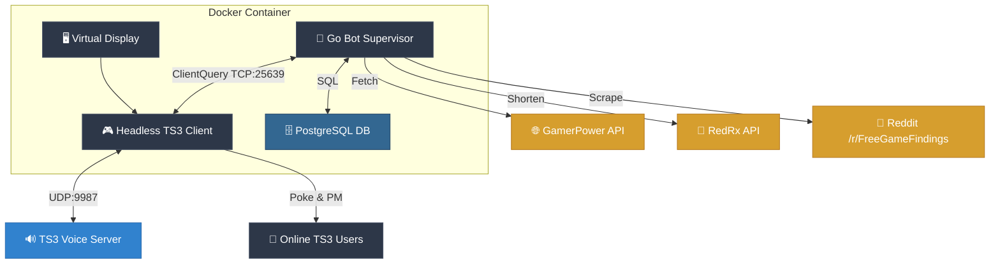

<p align="center">
  
</p>

<h1 align="center">TS3 Free Game RPG Bot 🎮</h1>

<p align="center">
  <a href="https://github.com/arumes31/ts3news/releases"></a>
  <a href="https://github.com/arumes31/ts3news/actions/workflows/ci.yml"></a>
  <a href="https://github.com/arumes31/ts3news/pkgs/container/ts3news"></a>
  <a href="LICENSE"></a>
</p>

<p align="center">
  <strong>A sophisticated, headless TeamSpeak 3 bot that notifies users of free PC games while featuring a deep, automated RPG progression system.</strong>
</p>

---

## 📐 Architecture & Flow

The bot runs a headless official TeamSpeak 3 client in a virtual framebuffer (Xvfb), controlled by a high-performance Go supervisor.



---

## 🚀 Key Features

*   🏆 **Legendary Leveling**: 10,000+ levels across 330+ tiers with procedurally generated fantasy names.
*   ⚔️ **Group Combat**: Users in the same channel automatically form a **Party** to fight randomly spawned mobs and bosses during every cycle.
*   🦾 **Massive Loot**: 24 equipment slots, 1,200+ gear variants, and 120+ rare titles.
*   🪄 **Skill System**: Over **300 unique skills and spells**. Users have 5 slots and automatically learn better skills found from loot.
*   ✨ **Enchantment System**: Rare mob drops that can be applied to gear for additional power or increased **Durability**.
*   🧪 **Consumables**: Potions and elixirs that are automatically consumed to restore HP or provide buffs.
*   🕒 **Persistence**: Full lifetime connection tracking and notification history stored in PostgreSQL.
*   ⚖️ **Auto-Balancing**: A **Combat Pity** system that buffs party stats if they suffer consecutive defeats.
*   🤖 **Contextual Personas**: The bot renames itself based on context, adopting the **godsfinger** persona for rare loot.
*   🖥️ **Headless Reliability**: Runs the official TS3 desktop client in Xvfb with a robust Go watchdog for 24/7 uptime.

---

## 🕹️ RPG Systems Deep-Dive

### 📈 Progression Mechanics
Your XP award per cycle is influenced by a complex set of multipliers:
| Modifier | Condition | Bonus |
| :--- | :--- | :---: |
| **Critical Hit** | 5% random chance on every poke. | **3.0x** |
| **Claim Streak** | Stay active for 3 / 5 / 7+ consecutive days. | **1.25x / 1.5x / 2.0x** |
| **Server Population** | Every additional online user (excluding the bot). | **+5% per user (2x cap)** |
| **Party System** | Multiple users sitting in the same channel. | **1.25x** |
| **INT Stat** | Cumulative Intelligence stat from your gear. | **Passive % Boost** |

### 🛡️ Equipment & Stats
Users manage **24 slots**. The bot follows a **Smart Auto-Equip** policy: it only replaces items if the new drop has a higher rarity or better overall stat score.

*   **Combat Stats**: HP (Health), STR (Damage), DEF (Damage Reduction), SPD (Turn Priority), LCK (Drop Quality), INT (XP Boost), STA (Reduces Dura Loss), CRT (Crit Chance), DGE (Dodge).
*   **Flavour Stats**: Charisma, Stench, Shiny, Hunger — affecting your personal report messages.
*   **Durability**: Gear loses 1 durability per fight (**3 on defeat**). Broken gear is automatically deleted. Use **Reinforcing Enchantments** to restore or increase max durability.
*   **Unique Legendaries**: Ultra-rare, named items with massive stats but very low durability (e.g. *Infinity Edge*).

### ⚔️ Combat & Mobs
During every notification cycle, a random encounter occurs for each party.
*   **Mob Scaling**: Enemies level up with you and gain gear-aware difficulty boosts.
*   **Mob Effects**: Enemies can spawn with effects like **Enraged** (+STR), **Armored** (+DEF), **Regenerative**, or **Poisoned**.
*   **World Bosses**: Rarely, a legendary boss will spawn, requiring high stats and party cooperation to defeat.

---

## ⚙️ Configuration

The bot is configured via environment variables or a `config.env` file.

| Category | Variable | Description | Default |
| :--- | :--- | :--- | :---: |
| **Server** | `TS3_HOST` | Hostname or IP of the TeamSpeak 3 server. | *Required* |
| | `TS3_PORT` | Voice port of the server (UDP). | `9987` |
| | `TS3_IDENTITY` | Your exported TeamSpeak identity string. | *None* |
| | `TS3_NICKNAME` | Default nickname for the bot. | `MrFree` |
| **Cycle** | `MIN_INTERVAL_HOURS` | Minimum random sleep between cycles. | `1` |
| | `MAX_INTERVAL_HOURS` | Maximum random sleep between cycles. | `12` |
| | `POKE_DELAY_MS` | Delay between individual pokes (anti-flood). | `1200` |
| **RPG** | `ENABLE_LEVELING` | Master switch for the XP and Rank systems. | `true` |
| | `ENABLE_XP_MODIFIERS` | Enable streaks, crits, and gear multipliers. | `true` |
| | `XP_SERVER_GROUPS` | Auto-create TS3 server groups for rank tiers. | `false` |
| | `CHEAPER_MORE_XP` | Invert XP scaling (cheaper games give more). | `false` |
| | `RESEND_AFTER_DAYS` | Allow re-sending a game after N days. | `60` |
| **Sources** | `ENABLE_GAMERPOWER` | Fetch from GamerPower API. | `true` |
| | `ENABLE_EPIC` | Fetch from Epic Games Store API. | `true` |
| | `ENABLE_REDDIT` | Fetch from /r/FreeGameFindings RSS. | `true` |
| | `REDRX_API_KEY` | API Key for [redrx.eu](https://redrx.eu/) link shortening. | *None* |
| **Database** | `DATABASE_URL` | PostgreSQL connection string. | *None* |
| | `DEAD_USER_DAYS` | Purge users inactive for N days. | `180` |

---

## 🛠️ Setup & Deployment

### Option A: Using the Pre-built GHCR Image (Recommended)

1.  **Create `docker-compose.yml`**:
    ```yaml
    services:
      db:
        image: postgres:15-alpine
        container_name: ts3-news-db
        restart: unless-stopped
        environment:
          POSTGRES_USER: ${DB_USER:-ts3bot}
          POSTGRES_PASSWORD: ${DB_PASS:-ts3botpass}
          POSTGRES_DB: ${DB_NAME:-ts3news}
        volumes:
          - postgres_data:/var/lib/postgresql/data
        healthcheck:
          test: ["CMD-SHELL", "pg_isready -U ${DB_USER:-ts3bot} -d ${DB_NAME:-ts3news}"]
          interval: 5s
          timeout: 5s
          retries: 5

      ts3-bot:
        image: ghcr.io/arumes31/ts3news:latest
        container_name: ts3-news-bot
        restart: unless-stopped
        stop_grace_period: 30s
        depends_on:
          db:
            condition: service_healthy
        env_file:
          - config.env
        environment:
          - DATABASE_URL=postgres://${DB_USER:-ts3bot}:${DB_PASS:-ts3botpass}@db:5432/${DB_NAME:-ts3news}?sslmode=disable
        logging:
          driver: "json-file"
          options:
            max-size: "10m"
            max-file: "3"

    volumes:
      postgres_data:
    ```
2.  **Configure**: Create `config.env` using `example.env` as a template.
3.  **Run**: `docker compose up -d`

### Option B: Building from Source

1.  **Clone the repository**.
2.  **Configure**: Create `config.env` with your settings.
3.  **Run**: Start the container and build:
    ```bash
    docker compose up -d --build
    ```

---

## 💻 Local Development & Testing

If you have Go installed, you can run the automated tests to verify the RPG logic:

```bash
# Run all unit tests
go test -v ./...
```

The tests verify notification filtering, database persistence, combat resolution, and loot logic.

---

## 📄 License

This project is licensed under the MIT License.

<p align="center">
  <em>Made with ⚔️ and 🎲 for the TeamSpeak community.</em>
</p>
