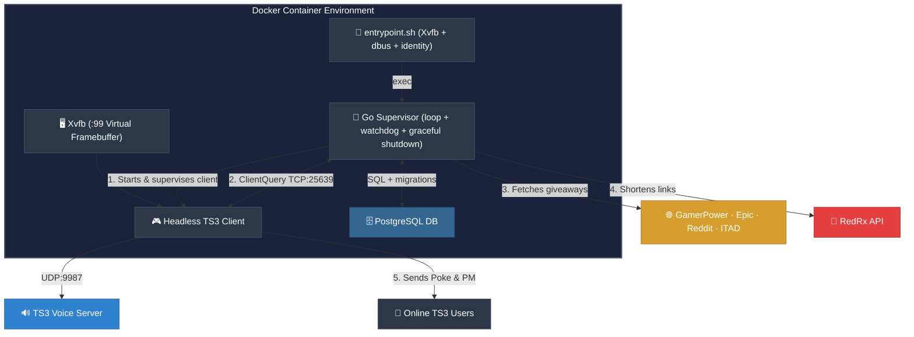

<p align="center">
  
</p>

<h1 align="center">TS3 Free Game Notification Bot 🎮</h1>

<p align="center">
  <a href="https://github.com/arumes31/ts3news"></a>
  <a href="https://github.com/arumes31/ts3news/blob/main/LICENSE"></a>
  <a href="https://github.com/arumes31/ts3news/stargazers"></a>
  <a href="https://github.com/arumes31/ts3news/issues"></a>
</p>

<p align="center">
  <strong>A Dockerized TeamSpeak 3 bot that automatically notifies users of free limited-time Steam and Epic Games Store giveaways.</strong>
</p>

<p align="center">
  It runs a headless instance of the official TeamSpeak 3 client inside Docker, connects to the server, and utilizes the <strong>ClientQuery</strong> plugin to poke and private message online clients.
</p>

---

## 🚀 Key Features

*   🖥️ **Headless TS3 Client**: Runs the official TS3 desktop client in Xvfb, bypassing SDK-based server connection blocks.
*   🔑 **Identity Injection**: Automates injecting high security-level identities (e.g. Level 29) directly into `settings.db`.
*   📣 **Double Notifications**: Sends a short, non-intrusive **Poke** popup (under 100 characters) + a detailed **Private Message** containing the game link.
*   🔗 **Short Link Integration**: Uses [redrx.eu](https://redrx.eu/) to provide clean, clickable links in pokes.
*   🌐 **Multi-Source Fetching**: Merges giveaways from **GamerPower**, the **Epic Games Store API**, **Reddit `/r/FreeGameFindings`** and (optionally) **IsThereAnyDeal**, de-duplicated across sources by title.
*   🎮 **DRM Filtering**: Only announces normally-paid titles on the platforms you choose (`steam`, `epic`, `gog`) — skipping free-to-play, expired, and unwanted-store giveaways.
*   ▶️ **Rich Messages**: Each PM includes a random greeting (100 variants), a YouTube trailer link, a gaming trivia fact, and seasonal **holiday theming**.
*   🏆 **Leveling System**: Users earn XP per poke across **10,000 fantasy-named levels** (30 levels per tier), shown in every PM, with optional TS3 server-group rewards at milestones.
*   🦾 **RPG Mechanics**: Features **24 unique gear slots**, mandatory starter loot, streaks, critical hits, and server-wide XP multipliers based on active population.
*   👑 **Rare Titles**: Rare fantasy titles (e.g. *Overlord*, *Godslayer*) are dynamically assigned as TS3 server groups with a **name prefix** for up to 7 days, granting massive XP buffs.
*   🩸 **Corrupted Artifacts**: High-risk, high-reward artifacts (e.g. *Cursed Chalice*) drop randomly, altering XP gains for 24 hours.
*   🕒 **Stat Tracking**: Automatically tracks every user's **total connection time** and session activity to reward long-term community members.
*   🤖 **Dynamic Nickname**: The bot renames itself to match the announced game, or adopts the **godsfinger** persona when delivering divine loot.
*   ⏱️ **Anti-Flood Control**: Customizable delay between actions to avoid server query anti-flood triggering.
*   🔄 **Go Supervisor**: A long-running supervisor connects, notifies, disconnects and sleeps a random interval — with a **watchdog** that restarts an unresponsive client and **graceful SIGTERM** shutdown that finishes the current cycle first.
*   🗄️ **Persistent History + Migrations**: Stores per-user history in **PostgreSQL** (schema managed by embedded **golang-migrate** migrations), with a per-user resend window and automatic **dead-user cleanup**.

---

## 📐 Architecture & Flow



---

## 🔗 RedRx URL Shortening

To keep TeamSpeak pokes clean and within the 100-character limit, this bot integrates with [redrx.eu](https://redrx.eu/), a specialized URL shortening service.

### Why RedRx?
*   **Space Efficiency**: TeamSpeak pokes are extremely limited. Shortened links ensure the game title and link both fit.
*   **Clickability**: Provides clean, professional-looking links that users are more likely to trust.

### How to get an API Key:
1.  Visit [redrx.eu](https://redrx.eu/).
2.  Register for a free account.
3.  Navigate to your **Dashboard** or **API Settings**.
4.  Generate a new **API Key**.
5.  Add this key to your `config.env` as `REDRX_API_KEY`.

---

## 💬 Notification Formats

### Poke (High Visibility)
The poke is strictly limited to 100 characters, always includes the shortened link, uses the clean game name (no platform tags / "Giveaway"), and ends with a short XP/level note.
> **Format:** `Free: [Game Name] [Link] +[XP]XP L[Level]`
> **Example:** `Free: Gravity Circuit https://redrx.eu/F73EA6 +21XP L3`

### Private Message (Details)
A richer private message is sent simultaneously, e.g.:
> 🎄 Frohe Weihnachten, gamer! A festive freebie for you:
> 🎮 Gravity Circuit
> 💰 Worth €19.99 → FREE now
> 🔗 Claim: https://redrx.eu/F73EA6
> ▶️ Trailer: https://www.youtube.com/results?search_query=Gravity+Circuit
> 🏆 Squire III (Lvl 53) — +21 XP (1,240 total)
> 💡 Did you know? Doom (1993) runs on everything — including pregnancy tests and fridges.
> Ho ho ho — happy holidays and happy gaming! 🎅

Greeting, trailer, trivia, leveling and holiday theming are each individually toggleable (see config).

**XP & levels:** users earn XP per poke, scaled by the game's price (a pricier game going free grants more XP — invert with `CHEAPER_MORE_XP=true`). The 10,000-level curve is tuned so the cap takes roughly **ten years** at ~one notification per day.

---

## 🕹️ Progression & RPG Systems

The bot features a deep, automated RPG layer that turns TeamSpeak activity into a long-term progression game.

### 📈 Earning XP
Users earn XP through multiple channels:
*   **Game Pokes**: The primary source. XP is scaled by the game's original price (e.g., a $60 game gives more than a $5 game). 
    *   *Note: If no new game is available, users still receive 50% XP just for being online during the cycle.*
*   **Daily Login**: The first connection of the day grants a flat **+5 XP**.
*   **Connection Time**: Total lifetime connection seconds are tracked and rewarded.

### ✖️ XP Multipliers (Buffs & Debuffs)
Your XP award per cycle is modified by:
| Modifier | Condition | Bonus |
| :--- | :--- | :---: |
| **Critical Hit** | 5% random chance on every poke. | **3.0x** |
| **Claim Streak** | Stay active for 3 / 5 / 7+ consecutive days. | **1.25x / 1.5x / 2.0x** |
| **Server Pop** | Every additional online user (excluding the bot). | **+5% per user (2x cap)** |
| **Party System** | All 4 members of a configured party are online. | **1.25x** |
| **Rare Title** | Held for 7 days (e.g. *Sovereign*, *Archon*). | **2.0x - 5.0x** |
| **Artifact** | Held for 24 hours (e.g. *Void Orb*). | **Massive Buff or Debuff** |

### 🛡️ Gear & Equipment
Every user is guaranteed to own at least one item. The bot manages **24 equipment slots** (Head, Chest, MainHand, Mount, Companion, etc.).
*   **Loot Drops**: Randomly occur during notification cycles.
*   **Automatic Management**: New loot automatically replaces old items in the same slot.
*   **Godsfinger**: When the bot delivers gear or artifacts, it adopts the **godsfinger** nickname for that specific notification.

### 💀 De-progression (The Sloth Penalty)
To keep the leaderboard competitive, an inactivity penalty is enforced:
*   **Trigger**: If a user is not seen on the server for **7 consecutive days**.
*   **The Drain**: The user loses **2% of their total XP every day** they remain offline.
*   **The Lock**: If decay causes a user to drop below a level milestone, they **lose the associated TS3 server group**.


---

## 📋 Prerequisites

Before deploying the bot, ensure you have the following ready:

1.  **TeamSpeak 3 Identity**:
    *   Generate a TeamSpeak 3 identity in your desktop client (**Tools > Identities**).
    *   Export the identity string. It should look like `358981685Veb71QAWiw...`.
    *   **Security Level**: Ensure the identity has a security level high enough to connect to your target server (e.g., Level 29).
2.  **Server Permissions**:
    *   The bot must be assigned to a server group with the following permissions:
        *   `b_virtualserver_client_list` (See all users)
        *   `b_virtualserver_channel_list` (See all channels)
        *   `i_client_poke_power` (Ability to poke users)
        *   `i_client_private_textmessage_power` (Ability to send PMs)
3.  **RedRx API Key**:
    *   Obtain an API key from [redrx.eu](https://redrx.eu/) for URL shortening.

---

## ⚙️ Configuration Options

All options are specified as environment variables in `config.env`.

| Variable | Description | Default | Required |
| :--- | :--- | :---: | :---: |
| `TS3_HOST` | Hostname or IP of the TeamSpeak 3 server. | *None* | 🔴 **Yes** |
| `TS3_PORT` | Voice port of the TeamSpeak 3 server (UDP). | `9987` | 🟢 No |
| `TS3_NICKNAME` | Nickname for the bot client. | `MrFree` | 🟢 No |
| `TS3_IDENTITY` | Exported identity string. | *None* | 🟢 No |
| `MIN_INTERVAL_HOURS` | Minimum random sleep (hours) between cycles. | `1` | 🟢 No |
| `MAX_INTERVAL_HOURS` | Maximum random sleep (hours) between cycles. | `12` | 🟢 No |
| `POKE_DELAY_MS` | Delay between pokes (anti-flood). | `1200` | 🟢 No |
| `CONNECT_TIMEOUT_SEC` | Max seconds to wait for client to connect each cycle. | `120` | 🟢 No |
| `REDRX_API_KEY` | API Key for redrx.eu URL shortening. | *None* | 🟢 No |
| `TS3_TARGET_NICK` | If set, only this nickname is poked (testing). | *None* | 🟢 No |
| `RESEND_AFTER_DAYS` | Re-allow sending a game after N days (0 = never). | `60` | 🟢 No |
| `DEAD_USER_DAYS` | Purge users not seen for N days (0 = never). | `180` | 🟢 No |
| **Sources** | | | |
| `ENABLE_GAMERPOWER` / `ENABLE_EPIC` / `ENABLE_REDDIT` | Toggle each game source. | `true` | 🟢 No |
| `ITAD_API_KEY` | IsThereAnyDeal API key (empty disables ITAD). | *None* | 🟢 No |
| `DRM_FILTER` | Platforms to keep: `steam`, `epic`, `gog`. | `steam,epic` | 🟢 No |
| **Message flavour** | | | |
| `ENABLE_YOUTUBE_TRAILER` / `ENABLE_TRIVIA` / `ENABLE_GREETINGS` / `ENABLE_HOLIDAY_THEMES` | Toggle PM extras. | `true` | 🟢 No |
| `DYNAMIC_NICKNAME` | Rename the bot to match the announced game. | `true` | 🟢 No |
| **Leveling** | | | |
| `ENABLE_LEVELING` | Track XP / levels and show them in the PM. | `true` | 🟢 No |
| `CHEAPER_MORE_XP` | `true` = cheaper games grant more XP; `false` = pricier games do. | `false` | 🟢 No |
| `LEVEL_GROUPS` | Milestone → existing server group, e.g. `10:7,50:8` (needs permission). | *None* | 🟢 No |
| `XP_SERVER_GROUPS` | Auto-create an icon'd server group per level tier; lazily created, auto-removed when empty (needs admin permission). | `false` | 🟢 No |
| **Lifecycle** | | | |
| `TS3_CLIENT_PATH` | Path to the TS3 client binary. | `/opt/ts3/ts3client_linux_amd64` | 🟢 No |
| `CONNECT_TIMEOUT_SEC` | Watchdog: max wait for the client to connect each cycle. | `120` | 🟢 No |

---

## 🛠️ Setup & Deployment

You can either use the pre-built image from the GitHub Container Registry or build it yourself.

### Option A: Using the Pre-built GHCR Image (Recommended)

1.  **Create `docker-compose.yml`**:
    ```yaml
    services:
      db:
        image: postgres:15-alpine
        container_name: ts3-news-db
        restart: unless-stopped
        environment:
          POSTGRES_USER: ${DB_USER:-ts3bot}
          POSTGRES_PASSWORD: ${DB_PASS:-ts3botpass}
          POSTGRES_DB: ${DB_NAME:-ts3news}
        volumes:
          - postgres_data:/var/lib/postgresql/data
        healthcheck:
          test: ["CMD-SHELL", "pg_isready -U ${DB_USER:-ts3bot} -d ${DB_NAME:-ts3news}"]
          interval: 5s
          timeout: 5s
          retries: 5

      ts3-bot:
        image: ghcr.io/arumes31/ts3news:latest
        container_name: ts3-news-bot
        restart: unless-stopped
        stop_grace_period: 30s
        depends_on:
          db:
            condition: service_healthy
        env_file:
          - config.env
        environment:
          - DATABASE_URL=postgres://${DB_USER:-ts3bot}:${DB_PASS:-ts3botpass}@db:5432/${DB_NAME:-ts3news}?sslmode=disable
        logging:
          driver: "json-file"
          options:
            max-size: "10m"
            max-file: "3"

    volumes:
      postgres_data:
    ```
2.  **Configure**: Create `config.env` and fill in your values (see `example.env` in this repo).
3.  **Run**: Start the container:
    ```bash
    docker compose up -d
    ```

### Option B: Building from Source

1.  **Clone the repository**.
2.  **Configure**: Rename `example.env` to `config.env` and fill in your values.
3.  **Run**: Start the container:
    ```bash
    docker compose up -d --build
    ```

---

## 💻 Local Development & Testing

If you have Go installed, you can run the automated tests to verify the bot logic:

```bash
# Run unit tests
go test -v ./internal/bot/...
```

The tests verify:
*   **Notification Filtering**: Ensures the bot correctly identifies and skips games already sent to a user.
*   **Database Persistence**: Validates that the bot correctly interacts with the PostgreSQL history table.

---

## 📄 License

This project is licensed under the MIT License.
