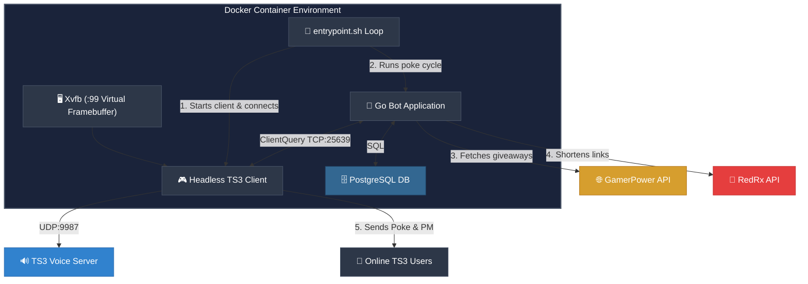

<p align="center">
  
</p>

<h1 align="center">TS3 Free Game Notification Bot 🎮</h1>

<p align="center">
  <a href="https://github.com/arumes31/ts3news"></a>
  <a href="https://github.com/arumes31/ts3news/blob/main/LICENSE"></a>
  <a href="https://github.com/arumes31/ts3news/stargazers"></a>
  <a href="https://github.com/arumes31/ts3news/issues"></a>
</p>

<p align="center">
  <strong>A Dockerized TeamSpeak 3 bot that automatically notifies users of free limited-time Steam and Epic Games Store giveaways.</strong>
</p>

<p align="center">
  It runs a headless instance of the official TeamSpeak 3 client inside Docker, connects to the server, and utilizes the <strong>ClientQuery</strong> plugin to poke and private message online clients.
</p>

---

## 🚀 Key Features

*   🖥️ **Headless TS3 Client**: Runs the official TS3 desktop client in Xvfb, bypassing SDK-based server connection blocks.
*   🔑 **Identity Injection**: Automates injecting high security-level identities (e.g. Level 29) directly into `settings.db`.
*   📣 **Double Notifications**: Sends a short, non-intrusive **Poke** popup (under 100 characters) + a detailed **Private Message** containing the game link.
*   🔗 **Short Link Integration**: Uses [redrx.eu](https://redrx.eu/) to provide clean, clickable links in pokes.
*   🎮 **PC Only**: Filters for PC-specific giveaways (Steam, Epic, GOG, etc.), ignoring mobile and console-only offers.
*   ⏱️ **Anti-Flood Control**: Customizable delay between actions to avoid server query anti-flood triggering.
*   🔄 **Single-Cycle Flow**: Designed to connect, notify, close the client, and sleep to conserve system memory.
*   🗄️ **Persistent History**: Stores game notification history in a **PostgreSQL** database to prevent duplicate pokes across restarts.

---

## 📐 Architecture & Flow



---

## 🔗 RedRx URL Shortening

To keep TeamSpeak pokes clean and within the 100-character limit, this bot integrates with [redrx.eu](https://redrx.eu/), a specialized URL shortening service.

### Why RedRx?
*   **Space Efficiency**: TeamSpeak pokes are extremely limited. Shortened links ensure the game title and link both fit.
*   **Clickability**: Provides clean, professional-looking links that users are more likely to trust.

### How to get an API Key:
1.  Visit [redrx.eu](https://redrx.eu/).
2.  Register for a free account.
3.  Navigate to your **Dashboard** or **API Settings**.
4.  Generate a new **API Key**.
5.  Add this key to your `config.env` as `REDRX_API_KEY`.

---

## 💬 Notification Formats

### Poke (High Visibility)
The poke is strictly limited to 100 characters and always includes the shortened link.
> **Format:** `Free: [Game Title] [Link]`

### Private Message (Details)
A private message is sent simultaneously with the full title and link.
> **Format:** `Daily Free Game! Title: [Game Title]. Link: [Link]`

---

## 📋 Prerequisites

Before deploying the bot, ensure you have the following ready:

1.  **TeamSpeak 3 Identity**:
    *   Generate a TeamSpeak 3 identity in your desktop client (**Tools > Identities**).
    *   Export the identity string. It should look like `358981685Veb71QAWiw...`.
    *   **Security Level**: Ensure the identity has a security level high enough to connect to your target server (e.g., Level 29).
2.  **Server Permissions**:
    *   The bot must be assigned to a server group with the following permissions:
        *   `b_virtualserver_client_list` (See all users)
        *   `b_virtualserver_channel_list` (See all channels)
        *   `i_client_poke_power` (Ability to poke users)
        *   `i_client_private_textmessage_power` (Ability to send PMs)
3.  **RedRx API Key**:
    *   Obtain an API key from [redrx.eu](https://redrx.eu/) for URL shortening.

---

## ⚙️ Configuration Options

All options are specified as environment variables in `config.env`.

| Variable | Description | Default | Required |
| :--- | :--- | :---: | :---: |
| `TS3_HOST` | Hostname or IP of the TeamSpeak 3 server. | *None* | 🔴 **Yes** |
| `TS3_PORT` | Voice port of the TeamSpeak 3 server (UDP). | `9987` | 🟢 No |
| `TS3_NICKNAME` | Nickname for the bot client. | `MrFree` | 🟢 No |
| `TS3_IDENTITY` | Exported identity string. | *None* | 🟢 No |
| `CHECK_INTERVAL_HOURS` | Delay in hours between cycles. | `12` | 🟢 No |
| `POKE_DELAY_MS` | Delay between pokes (anti-flood). | `1200` | 🟢 No |
| `REDRX_API_KEY` | API Key for redrx.eu URL shortening. | *None* | 🔴 **Yes** |
| `TS3_TARGET_NICK` | If set, only this nickname is poked (testing). | *None* | 🟢 No |

---

## 🛠️ Setup & Deployment

1.  **Configure**: Rename `example.env` to `config.env` and fill in your values.
2.  **Run**: Start the container:
    ```bash
    docker compose up -d --build
    ```

---

## 💻 Local Development & Testing

If you have Go installed, you can run the automated tests to verify the bot logic:

```bash
# Run unit tests
go test -v ./internal/bot/...
```

The tests verify:
*   **Notification Filtering**: Ensures the bot correctly identifies and skips games already sent to a user.
*   **Database Persistence**: Validates that the bot correctly interacts with the PostgreSQL history table.

---

## 📄 License

This project is licensed under the MIT License.
