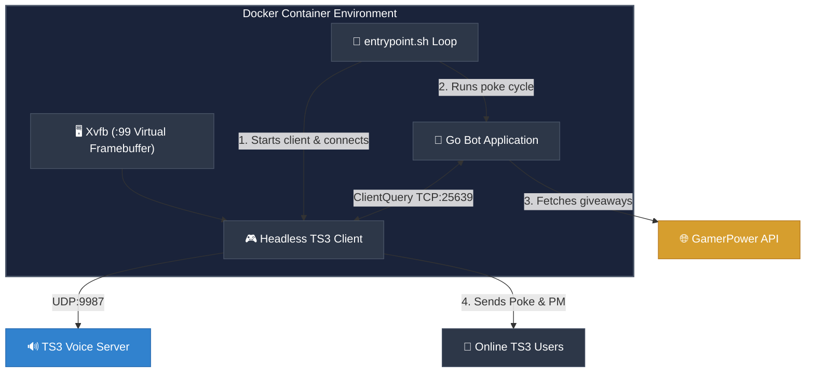

<p align="center">
  
</p>

<h1 align="center">TS3 Free Game Notification Bot 🎮</h1>

<p align="center">
  <a href="https://github.com/arumes31/ts3news"></a>
  <a href="https://github.com/arumes31/ts3news/blob/main/LICENSE"></a>
  <a href="https://github.com/arumes31/ts3news/stargazers"></a>
  <a href="https://github.com/arumes31/ts3news/issues"></a>
</p>

<p align="center">
  <strong>A Dockerized TeamSpeak 3 bot that automatically notifies users of free limited-time Steam and Epic Games Store giveaways.</strong>
</p>

<p align="center">
  It runs a headless instance of the official TeamSpeak 3 client inside Docker, connects to the server, and utilizes the <strong>ClientQuery</strong> plugin to poke and private message online clients.
</p>

---

## 🚀 Key Features

*   🖥️ **Headless TS3 Client**: Runs the official TS3 desktop client in Xvfb, bypassing SDK-based server connection blocks.
*   🔑 **Identity Injection**: Automates injecting high security-level identities (e.g. Level 29) directly into `settings.db`.
*   📣 **Double Notifications**: Sends a short, non-intrusive **Poke** popup (under 100 characters) + a detailed **Private Message** containing the game link.
*   ⏱️ **Anti-Flood Control**: Customizable delay between actions to avoid server query anti-flood triggering.
*   🔄 **Single-Cycle Flow**: Designed to connect, notify, disconnect, and sleep to conserve system memory.

---

## 📐 Architecture & Flow



---

## ⚙️ Configuration Options

All options are specified as environment variables, which can be defined in a `config.env` file or passed directly to Docker Compose.

| Variable | Description | Default | Required |
| :--- | :--- | :---: | :---: |
| `TS3_HOST` | Hostname or IP of the TeamSpeak 3 server to connect to. | *None* | 🔴 **Yes** |
| `TS3_PORT` | Voice port of the TeamSpeak 3 server (UDP). | `9987` | 🟢 No |
| `TS3_NICKNAME` | Nickname for the bot client. | `MrFree` | 🟢 No |
| `TS3_IDENTITY` | Exported identity string (must meet target server security level). | *None* | 🟢 No |
| `CHECK_INTERVAL_HOURS` | Delay in hours between each check for new game giveaways. | `12` | 🟢 No |
| `POKE_DELAY_MS` | Milliseconds to wait between pokes/messages to prevent anti-flood bans. | `1200` | 🟢 No |
| `TS3_TARGET_NICK` | Strict nickname target for testing (if set, only this user is poked). | *None* | 🟢 No |
| `CLIENTQUERY_ADDR` | Local telnet address for the ClientQuery plugin. | `127.0.0.1:25639` | 🟢 No |
| `CLIENTQUERY_INI` | Configuration file path of ClientQuery plugin to retrieve api_key. | `/root/.ts3client/clientquery.ini` | 🟢 No |

---

## 🛠️ Setup & Deployment

### 1. Edit the Configuration
Create a `config.env` file in the project root containing your parameters:

```env
TS3_HOST=wowcraft.pw
TS3_PORT=9987
TS3_NICKNAME=FreeGameAnnouncer
TS3_IDENTITY=V2...your_exported_identity_string...
CHECK_INTERVAL_HOURS=12
POKE_DELAY_MS=1200
# TS3_TARGET_NICK=MyTestName
```

> [!NOTE]
> `TS3_IDENTITY` should contain the value of the exported identity (e.g. `identity="V2...="`). You can export this from your desktop client. Make sure it meets the target server's minimum security level.

### 2. Run the Container
Start the container using Docker Compose:

```bash
docker compose up -d --build
```

---

## 💻 Local Development

If you have Go installed, you can run tests and lint check locally:

```powershell
# Run golangci-lint
golangci-lint run

# Run unit tests
go test ./...
```

---

## 📄 License

This project is licensed under the [MIT License](file:///c:/DR/Nextcloud/BUILD/ts3news/LICENSE) - see the [LICENSE](file:///c:/DR/Nextcloud/BUILD/ts3news/LICENSE) file for details.
