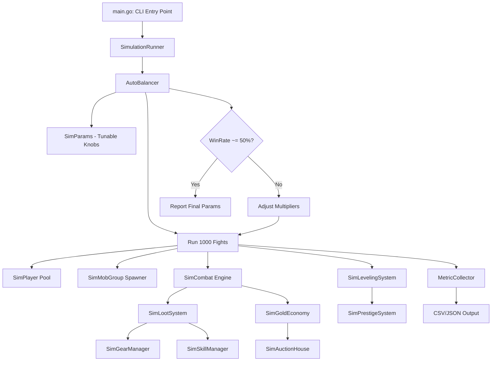
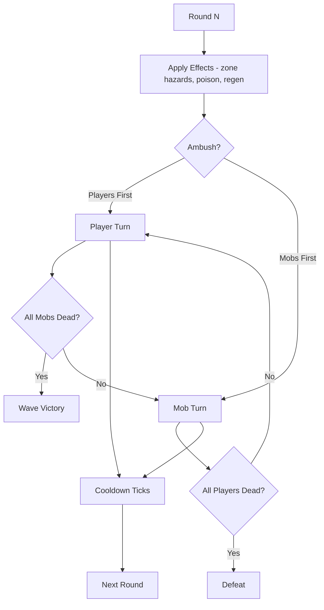
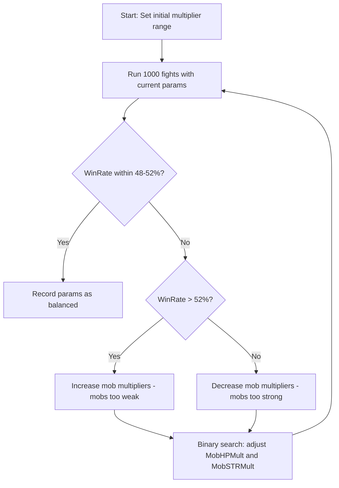

# RPG Balance Simulation — Architecture Plan

## Goal
Build a **standalone, DB-free simulation** that mirrors the real bot combat engine as closely as possible, runs **1000 fights** per configuration, and **auto-tunes multipliers** until the average win rate converges to **~50%** across group sizes **1, 4, 5, 6** players.

---

## 1. Problem Statement

The existing [`cmd/simulation/main.go`](cmd/simulation/main.go) has several gaps vs. the real engine in [`internal/bot/xp.go`](internal/bot/xp.go):

| Feature | Real Engine | Existing Sim |
|---|---|---|
| Multi-wave combat | 1-3 waves per fight | Single wave |
| Ambush mechanic | 50% chance mobs go first | Not modeled |
| Skill system | 30% proc, combo, stun, ignore-def | Flat `SkillChanceCombat` / `SkillPowerBase` |
| Ultimate skills | Cooldown-based, power multiplier | Dummy counter only |
| Dodge/Parry/Stealth | DGE cap 25%, parry 10%, stealth round-1 | Not modeled |
| Elemental system | Fire>Air>Earth>Water>Fire, 2x/0.5x | Not modeled |
| Zone effects | Buff/Debuff/Hazard/Special | Not modeled |
| Positional combat | Frontline/Backline, chain attacks | Not modeled |
| Mob effects | Enraged/Armored/Fleet/Poisoned/Blinded/Regen/Weakened | Not modeled |
| Death effects | Summon/Explosion/Curse/BonusXP/LootRain | Not modeled |
| Lifesteal/MindControl/Pets | Full pet combat, betrayal, mind capture | Not modeled |
| Durability | 20% chance 3-8 loss, 35% on defeat | Flat -1/-3 |
| Gold economy | Inflation dampener above 10M | Flat 500g per win |
| Auction house | Auto-list unwanted, auto-buy upgrades | Basic list/buy |
| Pity system | +0.5 per loss, cap 3.0 | Modeled |
| Consumables | Auto-heal at <50% HP, revive | Not modeled |
| Item effects | Thorns, Vampiric, Berserk, Cleanse, etc. | Not modeled |

**The sim needs to mirror all of these to produce meaningful balance numbers.**

---

## 2. Architecture Overview



---

## 3. File Structure

All new code lives under `cmd/simulation/balance/` to avoid touching the existing sim:

```
cmd/simulation/balance/
├── main.go              # CLI entry, flag parsing, orchestration
├── params.go            # SimParams struct, defaults, validation
├── player.go            # SimPlayer, SimStats, gear/skill management
├── mob.go               # SimMob, SimMobGroup, scaling, effects
├── combat.go            # SimCombat: waves, rounds, turn resolution
├── loot.go              # SimLootSystem: drops, gear, skills, uniques
├── economy.go           # SimGoldEconomy, SimAuctionHouse
├── leveling.go          # XP curve, level-up, prestige
├── balancer.go          # AutoBalancer: binary search on multipliers
├── metrics.go           # MetricCollector, CSV/JSON export
└── balance_test.go      # Unit tests for combat math and convergence
```

---

## 4. Core Data Structures

### 4.1 SimParams — All Tunable Knobs

```go
type SimParams struct {
    // === Combat Multipliers - PRIMARY BALANCE KNOBS ===
    MobHPMult        float64  // Mob HP scaling multiplier
    MobSTRMult       float64  // Mob STR/DMG scaling multiplier  
    MobDEFMult       float64  // Mob DEF scaling multiplier
    PlayerHPMult     float64  // Player HP scaling multiplier
    PlayerSTRMult    float64  // Player STR scaling multiplier
    PlayerDEFMult    float64  // Player DEF scaling multiplier
    
    // === Mob Spawn Config ===
    BaseMobsMin      int      // Min mobs per wave
    BaseMobsMax      int      // Max mobs per wave
    HordeChance      float64  // 15% horde spawn
    BossChance       float64  // 10% boss spawn
    Wave2Chance      float64  // 20% 2nd wave
    Wave3Chance      float64  // 5% 3rd wave
    AmbushChance     float64  // 50% mobs go first
    MaxRounds        int      // 20 rounds per wave
    
    // === Scaling Curves ===
    MobLevelScale    float64  // 0.05 per level - matches real engine
    DifficultyDampen float64  // 0.3 - only 30% of difficulty applies
    GroupSizeScale   float64  // 0.1 per extra player on mob stats
    GroupSizeCap     float64  // 2.5 max group scaling
    
    // === Player Progression ===
    BaseHP           int      // 100
    BaseSTR          int      // 10
    BaseDEF          int      // 5
    HPGrowth         float64  // +5 per level
    STRGrowth        float64  // +1 per level
    DEFGrowth        float64  // +0.5 per level
    PrestigeStatBonus float64 // 0.15 per prestige
    
    // === Loot Chances ===
    GearDropChance   float64  // Per mob killed
    SkillDropChance  float64
    ArtifactChance   float64
    ConsumableChance float64
    EnchantmentChance float64
    UniqueItemChance float64
    UltimateSkillChance float64
    
    // === Skill Config ===
    SkillProcChance  float64  // 30% per attack
    ComboBonus       float64  // 1.25x for same skill twice
    ChainAttackChance float64 // 30% for 3+ player groups
    ChainDamagePct   float64  // 20% of STR
    
    // === Ultimate Config ===
    UltimateCooldown int
    UltimatePowerBase float64
    
    // === Defense Mechanics ===
    DodgeCap         int      // 25% max
    ParryChance      float64  // 10%
    StealthRound1    bool     // Skip first round mob attacks
    
    // === Durability ===
    DuraLossChance   float64  // 20% per fight
    DuraLossMin      int      // 3
    DuraLossMax      int      // 8
    DefeatDuraLossChance float64 // 35%
    DefeatDuraLossMin int     // 5
    DefeatDuraLossMax int     // 15
    
    // === Economy ===
    GoldPerMobXP     float64  // Gold = mobXP * factor
    InflationThreshold int64  // 10M gold
    InflationRate    float64  // Decay rate
    
    // === Pity ===
    PityPerLoss      float64  // +0.5
    PityCap          float64  // 3.0
    
    // === Zone ===
    ZoneDiffMin      float64  // 0.8
    ZoneDiffMax      float64  // 1.5
    
    // === XP ===
    XPMin            int
    XPMax            int
    ExponentCap      float64
    PrestigeLevel    int
    DeathXPPenalty   float64  // 0.05
}
```

### 4.2 SimPlayer

```go
type SimPlayer struct {
    ID               int
    Level            int
    XP               float64
    Prestige         int
    CurrentHP        int
    MaxHP            int
    Stats            SimStats
    Gear             map[string]*SimGear   // slot -> gear
    Skills           []SimSkill
    UltimateSkill    *SimUltimate
    Gold             int64
    PityStack        float64
    ConsecutiveLosses int
    ConsecutiveWins  int
    TotalFights      int
    TotalWins        int
    TotalLosses      int
    Position         SimPosition  // Frontline/Backline
    Element          SimElement
    UniqueItems      map[string]bool
    Pets             []*SimPet
    Consumables      []SimConsumable
    ItemEffects      []SimItemEffect
    LastSkillID      string  // For combo tracking
}
```

### 4.3 SimMob

```go
type SimMob struct {
    Name         string
    Type         SimMobType  // Common, EliteMinion, Elite, Miniboss, Boss, Legendary
    Level        int
    HP           int
    MaxHP        int
    Stats        SimStats
    Element      SimElement
    Effects      []SimMobEffect
    Spells       []SimSkill
    DeathEffect  *SimDeathEffect
    RewardXP     int
    RewardGold   int64
    STRMod       float64
    DEFMod       float64
    SPDMod       float64
}
```

### 4.4 SimCombatResult

```go
type SimCombatResult struct {
    Victory         bool
    Waves           int
    TotalRounds     int
    MobsKilled      int
    XPGained        float64
    XPPenalty       float64
    GoldGained      int64
    PlayerHPRemaining []int
    LootDrops       []SimLootDrop
    DamageDealt     int64
    DamageReceived  int64
}
```

---

## 5. Combat Engine — Mirrors Real Engine

The combat engine must replicate the logic in [`resolveChannelCombat`](internal/bot/xp.go:323):

### 5.1 Wave System
```
1. Roll waves: 1 (75%), 2 (20%), 3 (5%)
2. Roll ambush: 50% chance mobs attack first
3. For each wave:
   a. Spawn mob group via SpawnMobGroup logic
   b. Run up to 20 rounds
   c. If all mobs dead -> wave victory, next wave
   d. If all players dead -> defeat, end combat
4. After all waves -> distribute rewards
```

### 5.2 Round Resolution



### 5.3 Player Turn — Per Player

1. **Zone buff** — Apply zone buff to STR
2. **Momentum** — 10% chance for 10% STR boost
3. **Lifesteal/MultiStrike** — From title/gear effects
4. **Attack resolution:**
   - 30% chance to use a random skill (with combo bonus if same as last)
   - Else: regular attack with element multiplier
   - If ultimate ready: use ultimate instead
5. **Chain attack** — 30% chance for groups of 3+ to hit adjacent mob for 20% STR
6. **Mind control** — Capture mob below 20% threshold
7. **Lifesteal heal** — Heal % of damage dealt
8. **Pet attacks** — Each pet attacks, 3% betrayal chance

### 5.4 Mob Turn — Per Mob

1. **Skip if stunned** (SPD == 0, recover next round)
2. **Target selection** — Prioritize Frontline > any alive
3. **Backline evasion** — 50% miss for physical mobs vs backline
4. **Stealth** — Skip round 1 if player has stealth
5. **Parry** — 10% chance to counter for 50% STR
6. **Dodge** — DGE% chance, capped at 25%
7. **Spell cast** — 20% chance to use mob spell
8. **Element multiplier** — Fire>Air>Earth>Water
9. **Effect modifiers** — Enraged +50% STR, Weakened -50% STR
10. **Frontline defense** — 10% damage reduction
11. **Blinded** — 50% miss chance
12. **Thorns** — Reflect 10% damage back

---

## 6. Loot System

Mirrors [`rollLootForUser`](internal/bot/xp.go) logic:

| Drop Type | Chance | Source |
|---|---|---|
| Gear | Per mob killed | Rarity weighted: 40% Common, 30% Uncommon, 18% Rare, 8% Epic, 3.2% Legendary, 0.6% Mythic, 0.2% Divine |
| Skill | Per mob killed | Rarity weighted similarly |
| Consumable | Per mob killed | Healing/Revive/Repair types |
| Enchantment | Per mob killed | Stat boost + XP multiplier |
| Unique Item | 1% per loot roll | Named collectible |
| Ultimate Skill | 0.5% per loot roll | Powerful cooldown ability |

### Gear Auto-Equip Logic
- Compare new gear `CombatRating()` vs equipped slot
- If upgrade: equip, list old on AH if Rare+
- If downgrade: list new on AH if Rare+

---

## 7. Economy System

### 7.1 Gold Income
- Per mob kill: `mob.RewardXP * (0.5 + random*0.5) * inflationMult`
- Inflation dampener: if total system gold > 10M, apply `1/(1 + (totalGold-10M)/5M)`

### 7.2 Gold Sinks
- Durability repair: 1g per point
- Auction house purchases
- Consumable purchases (simulated)

### 7.3 Auction House
- Players auto-list Rare+ items that are downgrades
- Players auto-buy items that are upgrades
- 7-day expiry on listings
- Price = `CombatRating * 10 + Stats.Score * 5 * (Rarity+1)`

---

## 8. Leveling & Prestige

### XP Curve — Mirrors [`leveling.go`](internal/leveling/leveling.go:100)
```
XPForLevel(level) = Round((level-1) ^ (1.2 + level/1500) * 1.5)
Exponent capped at ExponentCap (default 3.5)
```

### Prestige — Mirrors [`prestige.go`](internal/bot/prestige.go:14)
- Trigger at `PrestigeLevel` (default 5000 in sim, 9999 in real)
- Reset: Level=1, XP=0
- Bonus: +15% permanent stat boost per prestige

---

## 9. Auto-Balancer

The core innovation: **automatically find the multiplier values that produce ~50% win rate**.

### 9.1 Binary Search Algorithm



### 9.2 Multiplier Adjustment Strategy

The balancer adjusts **two primary knobs** in coordination:

1. **`MobSTRMult`** — Controls mob damage output (affects player survival)
2. **`MobHPMult`** — Controls mob health pool (affects time-to-kill)

**Adjustment rules:**
- If win rate > 52%: mobs too weak → increase both
  - `MobSTRMult += step * 0.6` (faster impact on survival)
  - `MobHPMult += step * 0.4` (slower impact on TTK)
- If win rate < 48%: mobs too strong → decrease both
  - `MobSTRMult -= step * 0.6`
  - `MobHPMult -= step * 0.4`
- Step size halves each iteration (binary search)
- Start step: 0.5, minimum step: 0.01
- Max iterations: 20

### 9.3 Per Group-Size Balancing

Run the balancer independently for each group size:

| Group Size | Party Bonus | Notes |
|---|---|---|
| 1 (Solo) | 1.0x | Baseline - hardest content |
| 4 | ~1.45x synergy + 1.6x party | Standard group |
| 5 | ~1.50x synergy + 1.75x party | Large group |
| 6 | ~1.55x synergy + 1.90x party | Raid-size, capped at 5.0 |

Each group size may need **different mob multipliers** to hit 50%. The simulation reports the per-group-size tuned values.

---

## 10. Simulation Flow

### 10.1 Main Loop

```
1. Create N players (default 15) with starter gear
2. For each fight (1..1000):
   a. Group players by party size (1/4/5/6)
   b. Select zone (random difficulty 0.8-1.5)
   c. Spawn mob group for party level + group size
   d. Run SimCombat (waves, rounds, full mechanics)
   e. Process loot drops
   f. Apply durability loss
   g. Distribute gold (with inflation)
   h. Process XP + level-ups + prestige
   i. Auto-list/buy on auction house
   j. Record metrics
3. After 1000 fights: report win rate, avg level, gold, gear score
4. Auto-balancer adjusts params and re-runs if needed
```

### 10.2 Player Initialization

```
- Level 1, 0 XP, 0 Prestige
- 3 starter gear pieces: MainHand, Chest, Legs (Uncommon rarity)
- 2 novice skills: NoviceSpark, NovicePunch
- 2000 starting gold
- Full HP
- No ultimate, no pets, no consumables
```

---

## 11. Metrics Collection

### 11.1 Per-Fight Metrics
- Win/Loss
- Rounds survived
- Mobs killed
- XP gained/lost
- Gold gained
- Loot drops (by type and rarity)
- Damage dealt/received
- Player HP remaining

### 11.2 Aggregate Metrics (after 1000 fights)
- **Win Rate** (primary balance metric)
- Average level reached
- Average gear score / item level
- Gold per player / inflation index
- Auction house utilization (listings, sales, sell rate)
- Prestige count
- Loot distribution by rarity
- Average fight duration (rounds)
- Pity stack distribution
- Survival rate by level bracket

### 11.3 Output Formats
- **Console**: Summary table with key metrics
- **CSV**: Per-fight data for spreadsheet analysis
- **JSON**: Full simulation state for programmatic analysis

---

## 12. CLI Interface

```
go run ./cmd/simulation/balance [flags]

Flags:
  -fights int        Number of fights per run (default 1000)
  -players int       Number of simulated players (default 15)
  -group-size int    Party size: 1, 4, 5, 6, or 0 for all (default 0)
  -balance           Enable auto-balancer (default true)
  -target-rate float Target win rate (default 0.50)
  -tolerance float   Win rate tolerance (default 0.02)
  -max-iter int      Max balancer iterations (default 20)
  -seed int          Random seed (default: time-based)
  -output string     Output format: console, csv, json (default console)
  -outdir string     Output directory for csv/json files
  -verbose           Print per-fight details
```

---

## 13. Implementation Order

1. **`params.go`** — Define all tunable parameters with sensible defaults
2. **`player.go`** — SimPlayer with full stat calculation, gear equip, skill management
3. **`mob.go`** — SimMob with proper scaling, effects, death effects, element system
4. **`combat.go`** — Full combat engine with waves, turns, all mechanics
5. **`loot.go`** — Loot drops with rarity weighting, auto-equip logic
6. **`economy.go`** — Gold economy with inflation, auction house
7. **`leveling.go`** — XP curve, level-up, prestige reset
8. **`metrics.go`** — Metric collection and export
9. **`balancer.go`** — Auto-balancer with binary search
10. **`main.go`** — CLI entry point, orchestration
11. **`balance_test.go`** — Unit tests for combat math, convergence validation

---

## 14. Key Balance Insights from Current Code

From analyzing the existing simulation and real engine:

1. **`MobDamageMult = 2.52`** is the current "sweet spot" for solo in the old sim — but the old sim lacks dodge/parry/skills/elements, so the real value will be **lower** when those defensive mechanics are included.

2. **Group synergy compounds hard**: `partyBonus = (1 + (n-1)*0.15) * (1 + (n-1)*0.05)`. For 6 players this is `1.75 * 1.25 = 2.19x` before the 5.0 cap. Groups will need **significantly stronger mobs**.

3. **The pity system** (`+0.5 per loss, cap 3.0`) acts as a natural stabilizer — after 6 consecutive losses, players get a 4.0x damage boost. This should help convergence.

4. **Early game is critical**: Below level 10, `lvlScale *= 0.5` makes mobs much weaker. The sim must model this or low-level win rates will be skewed.

5. **Durability is a hidden power drain**: As gear breaks, players lose stats, creating a downward spiral. The sim must model this to capture long-run equilibrium.

---

## 15. Validation Strategy

After implementation, validate by:

1. **Deterministic seed test**: Run with fixed seed, verify identical results
2. **Win rate convergence**: Assert balancer finds 50% ± 2% within 15 iterations
3. **Group size monotonicity**: Larger groups should need higher mob multipliers
4. **Economy stability**: Gold per player should not grow unboundedly over 1000 fights
5. **Level progression**: Average level should increase monotonically, with prestige resets visible
6. **Compare with real bot**: Run both with same parameters, verify sim win rate is within 5% of observed real win rate
