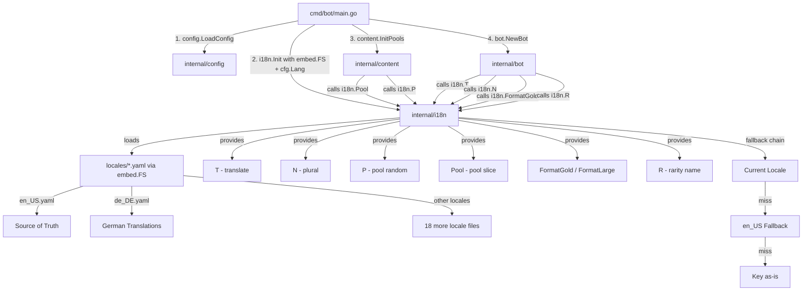
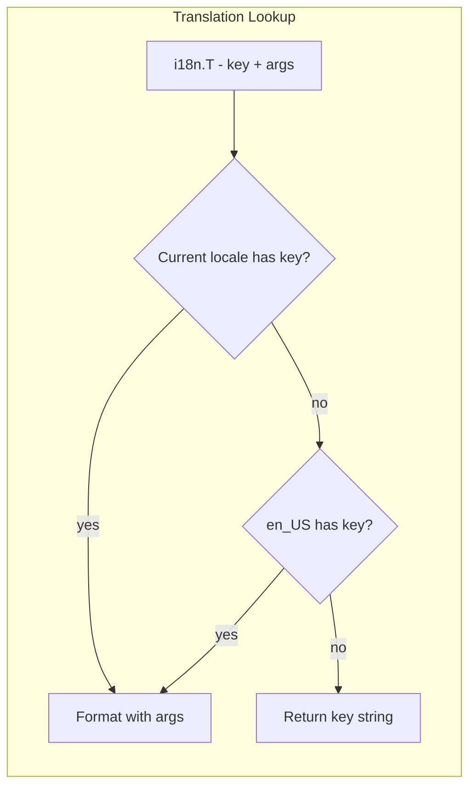
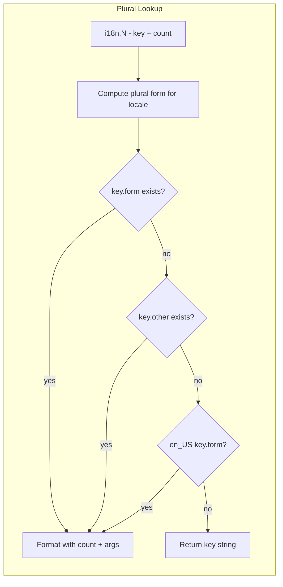

# i18n Architecture Design — ts3news

## 1. Overview

This document defines the internationalization (i18n) architecture for the ts3news TeamSpeak 3 bot with RPG mechanics. The project has ~276 unique user-facing string patterns and ~600 procedural content words that need translation across 20 locales.

**Design principles:**
- Zero external dependencies (no `golang.org/x/text` — a lightweight custom implementation is simpler for this scope)
- All translation files embedded in the binary via `embed.FS`
- Explicit positional arguments in all format strings for word-order flexibility
- BBCode preserved as-is in translated strings
- TS3 server group names remain in English for parsing stability; display names are translated

---

## 2. Package Structure

```
internal/i18n/
├── i18n.go          # Bundle, Init(), T(), N(), P() API
├── bundle.go        # Locale loading, embedding, fallback logic
├── plural.go        # Plural rule engine (CLDR-based)
├── format.go        # Positional format verb rewriting & execution
├── number.go        # Locale-aware number formatting
├── i18n_test.go     # Core API tests
├── plural_test.go   # Plural rule tests
├── format_test.go   # Format verb tests
└── locales/         # Embedded translation files
    ├── en_US.yaml   # Source of truth (complete)
    ├── de_DE.yaml
    ├── es_ES.yaml
    ├── fr_FR.yaml
    ├── it_IT.yaml
    ├── pt_BR.yaml
    ├── ja_JP.yaml
    ├── ko_KR.yaml
    ├── zh_CN.yaml
    ├── zh_TW.yaml
    ├── ru_RU.yaml
    ├── pl_PL.yaml
    ├── tr_TR.yaml
    ├── nl_NL.yaml
    ├── sv_SE.yaml
    ├── cs_CZ.yaml
    ├── ar_SA.yaml
    ├── th_TH.yaml
    ├── vi_VN.yaml
    └── hi_IN.yaml
```

---

## 3. Translation File Format — YAML

**Chosen: YAML** (with `sigs.k8s.io/yaml` for parsing — already commonly available, or use a minimal YAML parser)

### Rationale

| Criterion | YAML | JSON | TOML |
|---|---|---|---|
| Multi-line strings (BBCode) | ✅ Native block scalars | ❌ Escaped newlines | ⚠️ No multi-line |
| Comments for translators | ✅ `# translator note` | ❌ No comments | ✅ `# comment` |
| Human readability | ✅ Best | ❌ Poor for long strings | ✅ Good |
| Go stdlib parse | ❌ Needs lib | ✅ `encoding/json` | ❌ Needs lib |
| Merging/patching | ✅ Simple | ⚠️ Verbose | ⚠️ Verbose |

YAML wins because: (1) translators will hand-edit these files and need comments + readable multi-line BBCode strings, (2) the file count is small (20 files), (3) we need a YAML library anyway for the `content/pools` files.

**Library choice:** Add `gopkg.in/yaml.v3` as the only new dependency. It is the de-facto standard Go YAML library, stable, and minimal.

### File Format Specification

```yaml
# Locale metadata
_locale:
  name: "English (US)"
  plural_rule: "one_other"     # CLDR plural rule identifier
  number_format: "1,234.56"    # Pattern for number formatting

# ─── Bot Messages ───

bot.poke.free: "Free: "
bot.poke.daily_game: "Daily Free Game!"

bot.pm.greeting: "[b]%s[/b]"
bot.pm.no_game: "🎮 No new games discovered in this cycle."
bot.pm.game_line: "🎮 %[1]s"
bot.pm.worth_line: "💰 Worth %[1]s → [b]FREE[/b] now"
bot.pm.claim_line: "🔗 [b]Claim:[/b] %[1]s"
bot.pm.trailer_line: "▶️ [b]Trailer:[/b] %[1]s"

# ─── Player Stats Header ───

bot.stats.header: >-
  🏆 [b]%[1]s[/b] [color=#ffc107][P:%[2]d][/color]
  [color=#78909c][LvL: %[3]d][/color]
  [color=#00bcd4][gs: %[4].1f][/color]
  [color=#e91e63][CR: %[5].0f][/color]

bot.stats.xp_line: "📈 +%[1]d XP ([b]%[2]s[/b] total | [color=#90a4ae]Next: %[3]s[/color])"
bot.stats.level_up: "🎉 [b]Level up! You are now a %[1]s![/b]"
bot.stats.hp_line: >-
  [color=#90a4ae]HP:%[1]d/%[2]d STR:%[3]d DEF:%[4]d
  SPD:%[5]d LCK:%[6]d INT:%[7]d STA:%[8]d
  CRT:%[9]d DGE:%[10]d[/color]

# ─── Section Headers ───

bot.section.bonuses: "[b]✨ BONUSES & MODIFIERS[/b]"
bot.section.combat: "[b]⚔️ COMBAT LOG[/b]"
bot.section.loot: "[b]🎁 LOOT & REWARDS[/b]"
bot.section.equipment: "[b]🛡️ EQUIPMENT & CRAFTING[/b]"

# ─── Combat Log ───

combat.wave_approaches: "📢 WAVE %[1]d APPROACHES!"
combat.wave_header: "⚔️ WAVE %[1]d [CR:%[2]d]: %[3]s"
combat.ambush: "⚠️ AMBUSH! Enemies attack first!"
combat.double_attack: "⚔️ %[1]s double attack!"
combat.stunned: "💫 %[1]s STUNNED!"
combat.ultimate: "🌟 ULTIMATE: %[1]s deals %[2]d dmg!"
combat.captive: "🌀 Captive: %[1]s!"
combat.defeated: "☠️ %[1]s defeated by %[2]s!"
combat.killed_by_pet: "☠️ %[1]s killed by pet %[2]s!"
combat.slain_by: "💀 %[1]s was slain by %[2]s!"
combat.slain_by_hazard: "💀 %[1]s was slain by %[2]s hazard!"
combat.slain_by_explosion: "💀 %[1]s was slain by explosion!"
combat.slain_by_pet: "💀 %[1]s was slain by pet %[2]s!"
combat.mob_hits: "💢 %[1]s hits %[2]s for %[3]d!"
combat.pet_hit: "🐾 %[1]s hit %[2]s for %[3]d!"
combat.rogue_pet_bite: "⚠️ Rogue Pet %[1]s bit %[2]s for %[3]d!"
combat.mob_cast: "🔥 %[1]s cast %[2]s!"
combat.parry: "🛡️ %[1]s PARRIED %[2]s's attack and countered!"
combat.shadow_slip: "💨 %[1]s slipped into the shadows! %[2]s missed."
combat.poison_tick: "🤢 %[1]s takes %[2]d poison damage (%[3]d stacks)!"
combat.revived_item: "🔥 %[1]s REVIVED [item:%[2]s]!"
combat.revived_phoenix: "✨ %[1]s REVIVED [item:phoenix]!"
combat.consumable_use: "🧪 %[1]s used %[2]s: Restored %[3]d HP (%[4].0f%%)!"
combat.hazard_active: "⛈️ %[1]s Hazard is active!"
combat.hazard_cleansed: "✨ %[1]s cleansed the %[2]s hazard!"
combat.death_trigger: "⚠️ %[1]s triggers %[2]s: %[3]s!"
combat.reinforcements: "📢 %[1]d reinforcements have arrived!"
combat.explosion: "💥 Explosion dealt %[1]d damage to everyone!"
combat.summary: "📊 Battle Summary: Party %[1]d dmg vs Mobs %[2]d dmg."
combat.victory: "🏁 VICTORY! Party defeated all %[1]d mobs in %[2]s."
combat.defeat: "🏁 DEFEAT! Party was overrun in %[1]s."
combat.enemy_count: "%[1]dx %[2]s"

# ─── Loot & Rewards ───

loot.looted: "🎁 %[1]s looted %[2]s: %[3]s"
loot.prestige: "🌟 PRESTIGE %[1]d! Reset to Lvl 1 — permanent +%[2]d%% stats!"
loot.prestige_poke: "🌟 CONGRATULATIONS! You have reached Prestige %[1]d!"
loot.loot_box: "LOOT BOX +%[1]d XP"
loot.daily_login: "daily login +%[1]d"
loot.int_bonus: "INT bonus x%[1].3f"
loot.no_game_penalty: "no new game -50%"
loot.equipped: >-
  Equipped: %[1]s [s:%[2]s] (gs:%[3]d CR:%[4].1f R:[color=%[5]s]%[6]s[/color])
loot.legendary_gear_poke: "⚔️ LEGENDARY GEAR: Equipped %[1]s!"
loot.learned_skill: "Learned %[1]s [skill:%[2]s] (Slot %[3]d)"
loot.ultimate_equipped: "Ultimate: %[1]s [ultimate:equipped]"
loot.ultimate_collected: "Ultimate: %[1]s [ultimate:collected]"
loot.ultimate_major_poke: "🌟 MAJOR LOOT: Learned Ultimate Skill %[1]s!"
loot.unique_drop: "Unique: %[1]s [unique:%[2]s] (%[3]s)"
loot.unique_poke: "💎 UNIQUE DROP: %[1]s!"
loot.artifact: "Artifact: %[1]s [artifact:%[2]s]"
loot.artifact_poke: "🏺 ARTIFACT FOUND: %[1]s!"
loot.title: "Title: %[1]s [title:%[2]s]"
loot.item: "Item: %[1]s [item:%[2]s]"
loot.salvaged_skill: "Salvaged %[1]s [skill]: +%[2]d Scrap"
loot.salvaged_gear: "Salvaged %[1]s [s:%[2]s]: +%[3]d Scrap"
loot.salvaged_enchant: "Salvaged %[1]s [enchant]: +%[2]d Scrap"
loot.salvaged_ultimate: "Duplicate %[1]s [ultimate]: Salvaged for %[2]d Scrap"
loot.salvaged_unique: "Duplicate %[1]s [unique]: Salvaged for %[2]d Scrap"
loot.ah_listed_skill: "Unwanted %[1]s [skill]: Listed on AH"
loot.ah_listed_gear: "Listed on AH: %[1]s [s:%[2]s] (R:[color=%[3]s]%[4]s[/color])"
loot.ah_listed_enchant: "Unwanted %[1]s [enchant]: Listed on AH"
loot.ah_listed_ultimate: "Duplicate %[1]s [ultimate]: Listed on AH"
loot.ah_listed_unique: "Duplicate %[1]s [unique]: Listed on AH"
loot.enchanted: "Enchanted [s:%[1]s] with %[2]s [enchant:%[3]s]"
loot.unwanted_enchant: "Unwanted %[1]s [enchant]: Listed on AH"
loot.found_gear: "Found: %[1]s [s:%[2]s] (gs:%[3]d CR:%[4].1f R:%[5]s)"
loot.scrap_stack: "Looted Scrap [s:%[1]s] (+%[2]d XP) (R:%[3]s)"

# ─── Durability ───

dura.broken: "🛡️ BROKEN: %[1]s (-%[2]d dur)"
dura.sustained: "🛡️ Sustained -%[1]d dur (%[2]d items, Avg: %[3].1f)"

# ─── XP Outcome ───

xp.battle: "🏆 Battle XP"
xp.lost: "💀 XP lost"
xp.outcome: "%[1]s: %+[2]d → %[3]s (Lvl %[4]d)"

# ─── Flavour Stats ───

flavour.stench: "You smell terrible!"
flavour.charming: "You are remarkably charming today."
flavour.glowing: "You are literally glowing."

# ─── Auction House ───

ah.vendor_sale: "🏪 [b]AH Vendor Sale:[/b] Your item [b]%[1]s[/b] didn't sell and was bought by a vendor for %[2]s (0.1%% value)."
ah.purchase: "🎁 [b]AH Purchase![/b] You bought [b]%[1]s[/b] for %[2]s!%[3]s"
ah.purchase_fee: " (Includes %[1]s contention fee)"
ah.sale: "💰 [b]AH Sale![/b] Your item [b]%[1]s[/b] was bought by [b]%[2]s[/b] for %[3]s!"

# ─── Channel Description ───

channel.header: "[center][b][size=14]🎮 RPG Players: %[1]d[/size][/b][/center]"
channel.player_line: >-
  • [b]%[1]s[/b] [color=#ffc107][P:%[2]d][/color]
  [color=#78909c][Lvl:%[3]d][/color]
  [color=#00bcd4][gs:%[4].1f][/color]
  [color=#e91e63][CR:%[5].0f][/color]
  [color=%[6]s][HP:%[7]d/%[8]d][/color]
  [color=#fbc02d][Gold:%[9]s][/color]
channel.stats_line: >-
  [size=9][color=#90a4ae]STR:%[1]d DEF:%[2]d SPD:%[3]d
  LCK:%[4]d INT:%[5]d STA:%[6]d CRT:%[7]d DGE:%[8]d[/color][/size]
channel.group_power: >-
  [center][b]🛡️ Group Power[/b]:
  [color=#e91e63]CR %[1].0f[/color] |
  [color=#00bcd4]Avg GS %[2].1f[/color][/center]

# ─── Holiday Themes ───

holiday.christmas.banner: "Frohe Weihnachten, gamer! A festive freebie for you:"
holiday.christmas.signoff: "Ho ho ho — happy holidays and happy gaming! 🎅"
holiday.new_year.banner: "Happy New Year, gamer! Start it with a free game:"
holiday.new_year.signoff: "Here's to a year full of loot — Frohes neues Jahr! 🥳"
holiday.halloween.banner: "Spooky free game incoming, mortal... 👻"
holiday.halloween.signoff: "Happy Halloween — claim it before it haunts your wishlist! 🦇"
holiday.valentine.banner: "A little love for your library this Valentine's:"
holiday.valentine.signoff: "Roses are red, this game is free — enjoy! 💝"
holiday.april_fools.banner: "This is NOT a prank — a genuinely free game:"
holiday.april_fools.signoff: "No joke, it's really free. Happy April Fools! 🤡"
holiday.easter.banner: "An Easter egg for your library — a free game:"
holiday.easter.signoff: "Frohe Ostern — hop to it before the giveaway ends! 🥚"

# ─── Greetings (100 entries) ───

greeting.001: "Hey gamer!"
greeting.002: "Loot drop incoming!"
greeting.003: "Incoming!"
# ... (all 100 greetings keyed as greeting.001 through greeting.100)

# ─── Rarity Names ───

rarity.common: "Common"
rarity.uncommon: "Uncommon"
rarity.rare: "Rare"
rarity.epic: "Epic"
rarity.legendary: "Legendary"
rarity.mythic: "Mythic"
rarity.divine: "Divine"

# ─── Mob Type Names ───

mob_type.common: "Common"
mob_type.elite_minion: "EliteMinion"
mob_type.elite: "Elite"
mob_type.miniboss: "Miniboss"
mob_type.boss: "Boss"
mob_type.legendary: "Legendary"

# ─── Stat Labels ───

stat.hp: "HP"
stat.str: "STR"
stat.def: "DEF"
stat.spd: "SPD"
stat.lck: "LCK"
stat.int: "INT"
stat.sta: "STA"
stat.crt: "CRT"
stat.dge: "DGE"

# ─── Number Suffixes ───

number.suffix.k: "k"
number.suffix.m: "M"
number.suffix.b: "B"
number.gold_suffix: "g"

# ─── Content Pools (P2 — procedural name words) ───

pool.mob.prefix.001: "Snotty"
pool.mob.prefix.002: "Angry"
pool.mob.prefix.003: "Undead"
# ... (all 10 mob prefixes)
pool.mob.noun.001: "Rat"
pool.mob.noun.002: "Slime"
# ... (all 10 mob nouns)

pool.zone.prefix.001: "Volcanic"
# ... (all 20 zone effect prefixes)
pool.zone.suffix.001: "Eruption"
# ... (all 20 zone effect suffixes)

pool.skill.prefix.001: "Mortal"
# ... (all 50 skill prefixes)
pool.skill.action.001: "Strike"
# ... (all 40 skill actions)

pool.unique.adjective.001: "Ancient"
# ... (all 50 unique item adjectives)
pool.unique.noun.001: "Blade"
# ... (all 20 unique item nouns)

pool.death.prefix.001: "Last"
# ... (all 10 death effect prefixes)
pool.death.action.001: "Roar"
# ... (all 10 death effect actions)

pool.level.tier.001: "Drifter"
# ... (all 100 base tier names)
pool.level.epic_adj.001: "Ascendant"
# ... (all 30 epic adjectives)
pool.level.epic_title.001: "Champion"
# ... (all 30 epic titles)
pool.level.epic_realm.001: "Void"
# ... (all 30 epic realms)

pool.gamer_suffix.001: "Gamer"
# ... (all 8 gamer suffixes)
```

---

## 4. Message Key Naming Convention

Keys use **dot-separated hierarchical names** with the pattern:

```
<domain>.<section>.<specific>
```

| Domain | Covers | Examples |
|---|---|---|
| `bot` | Bot-level messages (poke, PM, stats, sections) | `bot.poke.free`, `bot.stats.level_up` |
| `combat` | Combat log entries | `combat.wave_approaches`, `combat.defeated` |
| `loot` | Loot/reward messages | `loot.equipped`, `loot.artifact_poke` |
| `dura` | Durability messages | `dura.broken`, `dura.sustained` |
| `xp` | XP outcome messages | `xp.battle`, `xp.outcome` |
| `flavour` | Flavour stat messages | `flavour.stench` |
| `ah` | Auction house messages | `ah.vendor_sale`, `ah.purchase` |
| `channel` | Channel description templates | `channel.header`, `channel.player_line` |
| `holiday` | Holiday theme banners/signoffs | `holiday.christmas.banner` |
| `greeting` | Greeting pool entries | `greeting.001` |
| `rarity` | Rarity display names | `rarity.legendary` |
| `mob_type` | Mob type display names | `mob_type.boss` |
| `stat` | Stat label abbreviations | `stat.str` |
| `number` | Number formatting suffixes | `number.suffix.k` |
| `pool` | Procedural name word pools | `pool.mob.prefix.001` |

**Rules:**
- Lowercase snake_case for all key segments
- Numeric suffixes for pool entries (zero-padded to 3 digits)
- Keys are stable — once assigned, they never change (only the translated values change)
- New keys are always appended at the end of their section

---

## 5. API Design

### 5.1 Core Types

```go
// internal/i18n/i18n.go

package i18n

import (
    "embed"
    "fmt"
    "strings"
)

// LocaleID is a BCP 47 locale identifier, e.g. "en_US", "de_DE".
type LocaleID string

const (
    LocaleEnUS LocaleID = "en_US"
    LocaleDeDE LocaleID = "de_DE"
    // ... all 20 locales
)

// defaultLocale is the fallback for missing translations.
const defaultLocale = LocaleEnUS
```

### 5.2 Bundle — The Central Translator

```go
// Bundle holds all loaded locale data and provides translation methods.
// It is initialized once at startup via Init() and then accessed globally.
type Bundle struct {
    locales map[LocaleID]*Locale
    current LocaleID
}

// Locale holds all translations for a single locale.
type Locale struct {
    ID      LocaleID
    Plural  PluralRule
    messages map[string]string
    pools   map[string][]string  // "mob.prefix" → ["Snotty", "Angry", ...]
}

// global is the package-level singleton, set by Init().
var global *Bundle

// Init loads all embedded locale files and sets the active locale.
// Must be called once at program startup before any T()/N()/P() calls.
func Init(fs embed.FS, locale LocaleID) error {
    b, err := loadBundle(fs, locale)
    if err != nil {
        return fmt.Errorf("i18n.Init: %w", err)
    }
    global = b
    return nil
}

// SetLocale changes the active locale at runtime (e.g., on SIGHUP).
func SetLocale(id LocaleID) error {
    if _, ok := global.locales[id]; !ok {
        return fmt.Errorf("i18n: unknown locale %q", id)
    }
    global.current = id
    return nil
}

// Locale returns the current active locale ID.
func Locale() LocaleID {
    return global.current
}
```

### 5.3 Translation Functions

```go
// T translates a message key with the given arguments.
// It uses the current locale, falling back to en_US, then the key itself.
//
// Format verbs in translation strings MUST use explicit positional indices:
//   "%[1]s defeated %[2]s" — not "%s defeated %s"
//
// This ensures correct word order in all languages.
func T(key string, args ...any) string {
    return global.translate(key, args...)
}

// N translates a message with plural form selection.
//   count = 1  → looks up key + ".one"
//   count != 1 → looks up key + ".other"
// The count value is available as %[1]d in the format string.
//
// Example:
//   i18n.N("combat.reinforcements", 3)
//   → looks up "combat.reinforcements.one" (count=1) or
//     "combat.reinforcements.other" (count≠1)
//   → format string: "📢 %[1]d reinforcements have arrived!"
func N(key string, count int, args ...any) string {
    return global.translatePlural(key, count, args...)
}

// P returns a random entry from a named content pool for the current locale.
//   pool := "mob.prefix"
//   name := i18n.P(pool)  → "Snotty" (random from pool)
//
// Falls back to en_US pool if the current locale's pool is empty.
func P(pool string) string {
    return global.randomPoolEntry(pool)
}

// Pool returns the full slice of entries for a named content pool.
// Used when the caller needs to iterate or index the pool directly.
func Pool(pool string) []string {
    return global.getPool(pool)
}

// R returns the translated rarity name for a given rarity constant.
func R(rarity int) string {
    keys := []string{
        "rarity.common", "rarity.uncommon", "rarity.rare",
        "rarity.epic", "rarity.legendary", "rarity.mythic", "rarity.divine",
    }
    if rarity < 0 || rarity >= len(keys) {
        return T("rarity.common")
    }
    return T(keys[rarity])
}
```

### 5.4 Internal Translation Logic

```go
// translate looks up key in current locale → en_US fallback → key itself.
func (b *Bundle) translate(key string, args ...any) string {
    msg := b.lookup(key)
    if msg == "" {
        return key // Last resort: return the key
    }
    return format(msg, args...)
}

// lookup finds the message in current locale, then en_US fallback.
func (b *Bundle) lookup(key string) string {
    // 1. Try current locale
    if loc, ok := b.locales[b.current]; ok {
        if msg, ok := loc.messages[key]; ok {
            return msg
        }
    }
    // 2. Fallback to en_US
    if b.current != defaultLocale {
        if loc, ok := b.locales[defaultLocale]; ok {
            if msg, ok := loc.messages[key]; ok {
                return msg
            }
        }
    }
    return "" // Caller will return the key itself
}

// translatePlural selects the correct plural form and then translates.
func (b *Bundle) translatePlural(key string, count int, args ...any) string {
    loc := b.locales[b.current]
    form := loc.Plural.Form(count) // "one", "other", "zero", "few", "many"

    pluralKey := key + "." + string(form)
    msg := b.lookup(pluralKey)

    // If the specific plural form is missing, try "other"
    if msg == "" && form != PluralOther {
        msg = b.lookup(key + ".other")
    }

    if msg == "" {
        return key // Last resort
    }

    // Prepend count to args so %[1]d is always the count
    allArgs := append([]any{count}, args...)
    return format(msg, allArgs...)
}
```

### 5.5 Format Verb Rewriting

The `format()` function handles the explicit positional verbs:

```go
// format is a wrapper around fmt.Sprintf that validates the format string.
// All translation strings use explicit positional arguments (%[1]s, %[2]d, etc.)
// so that translators can reorder them.
func format(pattern string, args ...any) string {
    // Direct delegation to fmt.Sprintf — Go's fmt package already supports
    // explicit positional arguments natively:
    //   fmt.Sprintf("%[2]s defeats %[1]s", "goblin", "hero") → "hero defeats goblin"
    return fmt.Sprintf(pattern, args...)
}
```

Go's `fmt.Sprintf` natively supports explicit positional arguments (`%[1]s`, `%[2]d`, etc.), so no custom format engine is needed. The key design decision is that **all translation strings in YAML files must use explicit positional indices**, enforced by a validation check at load time.

---

## 6. Locale File Structure & Loading

### 6.1 Embedding

```go
// internal/i18n/bundle.go

import "embed"

//go:embed locales/*.yaml
var localeFS embed.FS
```

### 6.2 Loading at Startup

```go
func loadBundle(fs embed.FS, active LocaleID) (*Bundle, error) {
    b := &Bundle{
        locales: make(map[LocaleID]*Locale),
        current: active,
    }

    // Always load en_US first (it's the fallback)
    allLocales := []LocaleID{
        LocaleEnUS, LocaleDeDE, LocaleEsES, LocaleFrFR, LocaleItIT,
        LocalePtBR, LocaleJaJP, LocaleKoKR, LocaleZhCN, LocaleZhTW,
        LocaleRuRU, LocalePlPL, LocaleTrTR, LocaleNlNL, LocaleSvSE,
        LocaleCsCZ, LocaleArSA, LocaleThTH, LocaleViVN, LocaleHiIN,
    }

    for _, id := range allLocales {
        filename := fmt.Sprintf("locales/%s.yaml", id)
        data, err := fs.ReadFile(filename)
        if err != nil {
            if id == LocaleEnUS {
                return nil, fmt.Errorf("i18n: critical — en_US locale missing: %w", err)
            }
            // Non-critical: missing locale will fall back to en_US
            continue
        }

        loc, err := parseLocale(data, id)
        if err != nil {
            return nil, fmt.Errorf("i18n: parse %s: %w", id, err)
        }

        // Validate: all format strings use explicit positional args
        if err := validateFormatStrings(loc.messages); err != nil {
            return nil, fmt.Errorf("i18n: validate %s: %w", id, err)
        }

        b.locales[id] = loc
    }

    // Ensure the active locale was loaded
    if _, ok := b.locales[active]; !ok {
        b.current = defaultLocale
    }

    return b, nil
}
```

### 6.3 YAML Parsing

```go
type yamlLocale struct {
    LocaleMeta map[string]string  `yaml:"_locale"`
    Messages   map[string]string  `yaml:",inline"` // All other keys
}

func parseLocale(data []byte, id LocaleID) (*Locale, error) {
    var raw yamlLocale
    if err := yaml.Unmarshal(data, &raw); err != nil {
        return nil, err
    }

    // Extract pool entries (keys starting with "pool.")
    messages := make(map[string]string)
    pools := make(map[string][]string)

    for k, v := range raw.Messages {
        if k == "_locale" {
            continue
        }
        if strings.HasPrefix(k, "pool.") {
            // Pool entries are indexed: pool.mob.prefix.001
            // Group by pool path: "pool.mob.prefix" → all entries
            parts := strings.SplitN(k, ".", 4) // ["pool", "mob", "prefix", "001"]
            if len(parts) == 4 {
                poolKey := strings.Join(parts[:3], ".") // "pool.mob.prefix"
                pools[poolKey] = append(pools[poolKey], v)
            }
        } else {
            messages[k] = v
        }
    }

    // Determine plural rule from metadata or locale ID
    pluralRule := pluralRuleForLocale(id)
    if rule, ok := raw.LocaleMeta["plural_rule"]; ok {
        pluralRule = parsePluralRule(rule)
    }

    return &Locale{
        ID:       id,
        Plural:   pluralRule,
        messages: messages,
        pools:    pools,
    }, nil
}
```

### 6.4 Format String Validation

```go
// validateFormatStrings ensures all messages use explicit positional arguments.
// This prevents translation bugs where word-order changes break implicit %s/%d.
func validateFormatStrings(msgs map[string]string) error {
    // Pattern matches non-positional verbs: %s, %d, %f, etc.
    // but NOT %[1]s, %[2]d, %%, or literal %%
    nonPositional := regexp.MustCompile(`%(?:\d*\.?\d*)[sdfeEgGxXouUbcqvp]`)

    for key, msg := range msgs {
        if nonPositional.MatchString(msg) {
            return fmt.Errorf("key %q: non-positional format verb in %q — use %%[N]s style", key, msg)
        }
    }
    return nil
}
```

**Note:** en_US validation is strict. For other locales, validation warnings are logged but not fatal (translators may be mid-work).

---

## 7. Fallback Behavior

The fallback chain is:

```
1. Current locale → key lookup
2. en_US locale → key lookup
3. Key itself → returned as-is
```

This ensures:
- A missing German translation falls back to English, not an empty string
- A missing English key (developer error) shows the key name, making the bug obvious
- No runtime panics or errors for missing translations

```go
// MissingKeyPolicy controls what happens when a key is missing entirely.
// In production, return the key. In development, log a warning.
var MissingKeyPolicy = "return_key" // or "log_warn" for dev builds
```

---

## 8. Pluralization Strategy

### 8.1 CLDR Plural Rules

Go has no built-in pluralization. We implement a minimal CLDR-based system supporting the 5 plural categories:

| Category | Meaning | Example Locales |
|---|---|---|
| `zero` | Count is 0 | ar_SA, lv_LV |
| `one` | Exactly 1 | en_US, de_DE, fr_FR, es_ES |
| `two` | Exactly 2 | ar_SA, cy |
| `few` | Small numbers | pl_PL (2-4), ru_RU (ends in 2-4 except 12-14) |
| `many` | Large numbers | pl_PL (5-21), ru_RU, ar_SA |
| `other` | Default/fallback | All locales |

### 8.2 Implementation

```go
// internal/i18n/plural.go

type PluralCategory string

const (
    PluralZero  PluralCategory = "zero"
    PluralOne   PluralCategory = "one"
    PluralTwo   PluralCategory = "two"
    PluralFew   PluralCategory = "few"
    PluralMany  PluralCategory = "many"
    PluralOther PluralCategory = "other"
)

type PluralRule func(n int) PluralCategory

// Rule definitions for each supported locale
var pluralRules = map[LocaleID]PluralRule{
    // English, German, Spanish, Italian, Dutch, Swedish, Czech, Vietnamese, Hindi:
    LocaleEnUS: ruleOneOther,
    LocaleDeDE: ruleOneOther,
    LocaleEsES: ruleOneOther,
    LocaleItIT: ruleOneOther,
    LocaleNlNL: ruleOneOther,
    LocaleSvSE: ruleOneOther,
    LocaleCsCZ: ruleCzech,    // zero/one/few/other
    LocaleViVN: ruleOther,    // No plural distinction
    LocaleHiIN: ruleOneOther,

    // French, Portuguese (BR):
    LocaleFrFR: ruleFrenchOneOther, // one=0,1; other=rest
    LocalePtBR: ruleFrenchOneOther,

    // Polish:
    LocalePlPL: rulePolish,   // one/few/many/other

    // Russian:
    LocaleRuRU: ruleRussian,  // one/few/many/other

    // Turkish:
    LocaleTrTR: ruleOneOther,

    // Asian (no plural distinction):
    LocaleJaJP: ruleOther,
    LocaleKoKR: ruleOther,
    LocaleZhCN: ruleOther,
    LocaleZhTW: ruleOther,
    LocaleThTH: ruleOther,

    // Arabic (full CLDR):
    LocaleArSA: ruleArabic,   // zero/one/two/few/many/other
}

// ruleOneOther: one=1, other=everything else
func ruleOneOther(n int) PluralCategory {
    if n == 1 {
        return PluralOne
    }
    return PluralOther
}

// rulePolish: one=1, few=2-4, many=5-21 (and 22-24→few, 25-31→many, etc.)
func rulePolish(n int) PluralCategory {
    if n == 1 {
        return PluralOne
    }
    mod10 := n % 10
    mod100 := n % 100
    if mod10 >= 2 && mod10 <= 4 && (mod100 < 12 || mod100 > 14) {
        return PluralFew
    }
    if (mod10 == 0 || mod10 == 1) || (mod10 >= 5 && mod10 <= 9) ||
        (mod100 >= 12 && mod100 <= 14) {
        return PluralMany
    }
    return PluralOther
}

// ruleRussian: one=1,21,31,... few=2-4,22-24,32-34,... many=0,5-20,25-30,...
func ruleRussian(n int) PluralCategory {
    mod10 := n % 10
    mod100 := n % 100
    if mod10 == 1 && mod100 != 11 {
        return PluralOne
    }
    if mod10 >= 2 && mod10 <= 4 && (mod100 < 12 || mod100 > 14) {
        return PluralFew
    }
    if mod10 == 0 || (mod10 >= 5 && mod10 <= 9) ||
        (mod100 >= 11 && mod100 <= 14) {
        return PluralMany
    }
    return PluralOther
}

// ruleCzech: zero=0, one=1, few=2-4, other=rest
func ruleCzech(n int) PluralCategory {
    if n == 0 {
        return PluralZero
    }
    if n == 1 {
        return PluralOne
    }
    if n >= 2 && n <= 4 {
        return PluralFew
    }
    return PluralOther
}

// ruleArabic: full CLDR Arabic plural rules
func ruleArabic(n int) PluralCategory {
    if n == 0 { return PluralZero }
    if n == 1 { return PluralOne }
    if n == 2 { return PluralTwo }
    mod100 := n % 100
    if mod100 >= 3 && mod100 <= 10 { return PluralFew }
    if mod100 >= 11 && mod100 <= 99 { return PluralMany }
    return PluralOther
}

// ruleOther: always "other" (Asian languages with no plural distinction)
func ruleOther(n int) PluralCategory {
    return PluralOther
}
```

### 8.3 YAML Plural Entries

Plural-aware keys are stored with sub-keys:

```yaml
# en_US.yaml
combat.reinforcements.one: "📢 1 reinforcement has arrived!"
combat.reinforcements.other: "📢 %[1]d reinforcements have arrived!"

# ja_JP.yaml (no plural distinction — only .other)
combat.reinforcements.other: "📢 %[1]d体の増援が到着！"

# pl_PL.yaml
combat.reinforcements.one: "📢 %[1]d posiłek przybył!"
combat.reinforcements.few: "📢 %[1]d posiłki przybyły!"
combat.reinforcements.many: "📢 %[1]d posiłków przybyło!"
```

### 8.4 Usage in Code

```go
// Before:
logs = append(logs, fmt.Sprintf("📢 %d reinforcements have arrived!", count))

// After:
logs = append(logs, i18n.N("combat.reinforcements", count))
```

---

## 9. Content Pool Strategy

### 9.1 Problem

Procedural name generation uses Go string slices (e.g., `[]string{"Snotty", "Angry", ...}`) to compose names like "Snotty Rat" or "Mortal Strike". These ~600 words need per-locale translation.

### 9.2 Design

Content pools are stored in the YAML files under the `pool.*` namespace. At load time, they are extracted into `Locale.pools` as `map[string][]string`.

**Key mapping convention:**

| Go variable | Pool key | Example entries |
|---|---|---|
| `prefixes` in `mobs.go` | `pool.mob.prefix` | `pool.mob.prefix.001` = "Snotty" |
| `nouns` in `mobs.go` | `pool.mob.noun` | `pool.mob.noun.001` = "Rat" |
| `prefixes` in `skills.go` | `pool.skill.prefix` | `pool.skill.prefix.001` = "Mortal" |
| `actions` in `skills.go` | `pool.skill.action` | `pool.skill.action.001` = "Strike" |
| `uniqueAdjectives` | `pool.unique.adjective` | `pool.unique.adjective.001` = "Ancient" |
| `uniqueNouns` | `pool.unique.noun` | `pool.unique.noun.001` = "Blade" |
| `epicAdjectives` | `pool.level.epic_adj` | `pool.level.epic_adj.001` = "Ascendant" |
| `epicTitles` | `pool.level.epic_title` | `pool.level.epic_title.001` = "Champion" |
| `epicRealms` | `pool.level.epic_realm` | `pool.level.epic_realm.001` = "Void" |
| `baseTierNames` | `pool.level.tier` | `pool.level.tier.001` = "Drifter" |
| `gamerSuffixes` | `pool.gamer_suffix` | `pool.gamer_suffix.001` = "Gamer" |
| Zone effect prefixes | `pool.zone.prefix` | `pool.zone.prefix.001` = "Volcanic" |
| Zone effect suffixes | `pool.zone.suffix` | `pool.zone.suffix.001` = "Eruption" |
| Death effect prefixes | `pool.death.prefix` | `pool.death.prefix.001` = "Last" |
| Death effect actions | `pool.death.action` | `pool.death.action.001` = "Roar" |

### 9.3 Content Package Integration

The `content` package currently uses package-level `var` slices initialized in `init()`. These will be replaced with calls to `i18n.Pool()`:

```go
// internal/content/mobs.go — BEFORE:
func init() {
    prefixes := []string{"Snotty", "Angry", "Undead", ...}
    nouns := []string{"Rat", "Slime", "Goblin", ...}
    for _, p := range prefixes {
        for _, n := range nouns {
            name := p + " " + n
            baseMobs = append(baseMobs, Mob{Name: name, ...})
        }
    }
}

// internal/content/mobs.go — AFTER:
func init() {
    prefixes := i18n.Pool("mob.prefix")
    nouns := i18n.Pool("mob.noun")
    for _, p := range prefixes {
        for _, n := range nouns {
            name := p + " " + n
            baseMobs = append(baseMobs, Mob{Name: name, ...})
        }
    }
}
```

**Important:** The `i18n.Init()` call must happen **before** any `content` package `init()` functions run. This requires careful initialization ordering (see Section 10).

### 9.4 Random Pool Access

For cases where only a random entry is needed (e.g., `RandomGreeting()`):

```go
// internal/content/greetings.go — BEFORE:
func RandomGreeting() string {
    return greetings[rand.IntN(len(greetings))]
}

// internal/content/greetings.go — AFTER:
func RandomGreeting() string {
    return i18n.P("greeting")
}
```

The `P()` function picks a random entry from the pool, falling back to en_US if the current locale's pool is empty.

### 9.5 Named Mobs / Zones / Hazards

Some content uses hardcoded names (e.g., `"Ancient Dragon"`, `"Elwynn Forest"`, `"Boiling Lava"`). These are translated as individual keys:

```yaml
mob.ancient_dragon: "Ancient Dragon"
mob.kraken: "Kraken of the Deep"
mob.void_lord: "THE VOID LORD"
mob.chronos: "CHRONOS, TIME EATER"

zone.elwynn_forest: "Elwynn Forest"
zone.westfall: "Westfall"
# ... etc

hazard.boiling_lava: "Boiling Lava"
hazard.toxic_fumes: "Toxic Fumes"
# ... etc
```

---

## 10. Config Integration

### 10.1 Adding LANG to Config

```go
// internal/config/config.go — additions

type Config struct {
    // ... existing fields ...

    // i18n
    Lang string // BCP 47 locale ID, e.g. "en_US", "de_DE"
}

func LoadConfig() *Config {
    return &Config{
        // ... existing fields ...

        Lang: envDefault("LANG", "en_US"),
    }
}
```

### 10.2 Initialization Order

The critical constraint is that `i18n.Init()` must run **before** any `content` package `init()` that calls `i18n.Pool()`. Since Go `init()` functions run in dependency order, we need an explicit initialization step.

**Solution:** Use a deferred init pattern in the `content` package:

```go
// internal/content/content.go — NEW FILE

package content

import "ts3news/internal/i18n"

// ready is closed once i18n is initialized.
var ready chan struct{}

func init() {
    ready = make(chan struct{})
}

// WaitForI18n blocks until i18n.Init() has been called.
// Called by all content init() functions that need pool data.
func WaitForI18n() {
    <-ready
}

// NotifyI18nReady is called by main after i18n.Init().
func NotifyI18nReady() {
    close(ready)
}
```

**Alternative (simpler, preferred):** Move pool-based initialization out of `init()` into explicit `Init()` functions called from `main()`:

```go
// cmd/bot/main.go — AFTER:
func main() {
    cfg := config.LoadConfig()

    // 1. Initialize i18n FIRST
    if err := i18n.Init(i18nLocaleFS, LocaleID(cfg.Lang)); err != nil {
        log.Fatalf("i18n init failed: %v", err)
    }

    // 2. Initialize content pools (depends on i18n)
    content.InitPools()

    // 3. Generate icons, create bot, etc.
    // ...
}
```

```go
// internal/content/mobs.go — AFTER:
var baseMobs []Mob

// InitPools builds the base mob list using i18n-translated pool entries.
// Must be called after i18n.Init().
func InitPools() {
    prefixes := i18n.Pool("mob.prefix")
    nouns := i18n.Pool("mob.noun")
    for _, p := range prefixes {
        for _, n := range nouns {
            name := p + " " + n
            baseMobs = append(baseMobs, Mob{Name: name, ...})
        }
    }
    // Named mobs
    baseMobs = append(baseMobs, Mob{Name: i18n.T("mob.ancient_dragon"), ...})
    // ...
}
```

This is the **recommended approach** — it eliminates `init()` ordering issues entirely and makes the startup sequence explicit.

---

## 11. Migration Strategy

### Phase 1: Infrastructure (no string changes)

1. Create `internal/i18n/` package with `Bundle`, `T()`, `N()`, `P()`, `R()` API
2. Create `internal/i18n/locales/en_US.yaml` with all English strings extracted
3. Add `Lang` field to `Config`
4. Add `i18n.Init()` call to `cmd/bot/main.go`
5. Add `gopkg.in/yaml.v3` dependency
6. Write tests for `T()`, `N()`, `P()`, fallback, format validation
7. **Verify:** All existing tests still pass (no behavior change yet)

### Phase 2: P0 Strings — Combat & Core (~110 strings)

1. Convert combat log strings in `internal/bot/xp.go` (resolveChannelCombat, applyEffects, userTurn, mobTurn, distributeRewards)
2. Convert loot result strings in `internal/bot/xp.go` (processLoot, applyDurabilityLoss)
3. Convert section headers in `internal/bot/bot.go` (composePM)
4. Convert stat labels and player header in `internal/bot/bot.go`
5. Convert XP outcome strings in `internal/bot/bot.go`
6. Convert prestige messages in `internal/bot/prestige.go`
7. Convert durability messages in `internal/bot/xp.go`
8. **Verify:** Run all existing tests, manual combat test

### Phase 3: P1 Strings — Greetings, Holidays, Auction (~125 strings)

1. Convert greetings in `internal/content/greetings.go` to pool entries
2. Convert holiday themes in `internal/content/holiday.go`
3. Convert auction messages in `internal/bot/auction.go`
4. Convert poke messages in `internal/bot/bot.go`
5. Convert channel description in `internal/bot/bot.go`
6. **Verify:** Greeting count test, holiday date test, auction test

### Phase 4: P2 Strings — Content Pools (~600 words)

1. Convert `internal/content/mobs.go` pool slices to `i18n.Pool()`
2. Convert `internal/content/skills.go` pool slices
3. Convert `internal/content/unique_items.go` pool slices
4. Convert `internal/content/zones.go` pool slices
5. Convert `internal/leveling/leveling.go` tier name pools
6. Convert `internal/content/nicknames.go` gamer suffixes
7. Convert `internal/content/hazards.go` named hazards
8. Move pool initialization from `init()` to `InitPools()` functions
9. **Verify:** All content tests pass, mob/skill/zone generation works

### Phase 5: Second Locale — de_DE Validation

1. Create `internal/i18n/locales/de_DE.yaml` with German translations
2. Test with `LANG=de_DE`
3. Fix any format verb issues, BBCode preservation issues
4. **Verify:** Full German run-through

### Phase 6: Remaining Locales

1. Create stub YAML files for all 18 remaining locales (copy en_US)
2. Translate progressively (community-driven or AI-assisted)
3. Add locale-specific plural rules as needed

### Migration Pattern — Per-String Conversion

For each string, the conversion follows this pattern:

```go
// BEFORE:
logs = append(logs, fmt.Sprintf("☠️ %s defeated by %s!", target.Name, u.Nickname))

// AFTER:
logs = append(logs, i18n.T("combat.defeated", target.Name, u.Nickname))
```

The en_US.yaml entry:
```yaml
combat.defeated: "☠️ %[1]s defeated by %[2]s!"
```

A German translator can reorder:
```yaml
combat.defeated: "☠️ %[2]s hat %[1]s besiegt!"
```

---

## 12. BBCode Handling

### 12.1 Design Decision: BBCode is Part of the Translation

BBCode tags (`[b]`, `[color=#hex]`, `[size=N]`, `[center]`, `[hr]`) are **included in the translated string**. This is necessary because:

1. Different languages may need different emphasis points
2. BBCode is simple enough that translators can handle it
3. Extracting BBCode into wrapper parameters would create an unmanageable API

### 12.2 Translator Guidelines

Translators receive these rules:
- **Never modify** BBCode tag names (`[b]`, `[color=...]`, `[/color]`, etc.)
- **May move** BBCode tags to wrap different words if the language requires it
- **May add/remove** BBCode if the locale's conventions differ (e.g., CJK may not need bold for emphasis)
- **Must preserve** `[color=#hex]` hex values exactly

### 12.3 Example

English:
```yaml
loot.equipped: "Equipped: %[1]s [s:%[2]s] (gs:%[3]d CR:%[4].1f R:[color=%[5]s]%[6]s[/color])"
```

German (same BBCode, different word order):
```yaml
loot.equipped: "Ausgerüstet: %[1]s [s:%[2]s] (gs:%[3]d CR:%[4].1f R:[color=%[5]s]%[6]s[/color])"
```

Japanese (may drop some formatting):
```yaml
loot.equipped: "装備: %[1]s [s:%[2]s] (gs:%[3]d CR:%[4].1f R:[color=%[5]s]%[6]s[/color])"
```

### 12.4 Poke Channel — No BBCode

`c.Poke()` sends plain text. Strings used in pokes must NOT contain BBCode. This is already the case in the current codebase (pokes are simple strings). The i18n system does not strip BBCode — it is the developer's responsibility to use BBCode-free keys for poke messages.

---

## 13. TS3 Group Name Handling

### 13.1 Problem

TS3 server group names serve a **dual purpose**:
1. **Display name** — shown to users in the TeamSpeak client
2. **Parsing prefix** — used by `prestigeFromGroupName()` and `levelFromGroupName()` to extract the level/prestige number

Current parsing code:
```go
// internal/bot/prestige.go
func prestigeGroupName(p int) string { return fmt.Sprintf("Prestige %d", p) }
func prestigeFromGroupName(name string) (int, bool) {
    if rest, ok := strings.CutPrefix(name, "Prestige "); ok {
        if n, err := strconv.Atoi(strings.TrimSpace(rest)); err == nil {
            return n, true
        }
    }
    return 0, false
}

// internal/bot/xpgroups.go
func xpGroupName(level int) string {
    n := leveling.LevelName(level)
    if len([]rune(n)) <= maxGroupNameLen { return n }
    return fmt.Sprintf("Lvl %d", level)
}
func levelFromGroupName(name string) (int, bool) {
    if l, ok := leveling.LevelByName(name); ok { return l, true }
    if rest, ok := strings.CutPrefix(name, "Lvl "); ok {
        if n, err := strconv.Atoi(strings.TrimSpace(rest)); err == nil { return n, true }
    }
    return 0, false
}
```

### 13.2 Design Decision: Group Names Stay in English

**TS3 server group names will NOT be translated.** Rationale:

1. **Parsing stability:** `prestigeFromGroupName("Prestige 5")` must always work. If a German translator changes it to `"Prestige 5" → "Prestige 5"`, the parsing still works. But if they change it to `"Prestige 5"`, the `strings.CutPrefix("Prestige ")` breaks.
2. **TS3 API constraints:** Group names are created once and referenced by name. Changing them per-locale would require creating locale-specific groups, which is infeasible.
3. **30-character limit:** Translated names may exceed TeamSpeak's 30-char group name limit.
4. **Cross-locale visibility:** All users on the same TS3 server see the same group names regardless of their locale.

### 13.3 Implementation

The group name generation and parsing functions remain **unchanged** — they always use English:

```go
// UNCHANGED — always English for TS3 group names
func prestigeGroupName(p int) string { return fmt.Sprintf("Prestige %d", p) }
func xpGroupName(level int) string {
    n := leveling.LevelName(level) // Always English tier names
    if len([]rune(n)) <= maxGroupNameLen { return n }
    return fmt.Sprintf("Lvl %d", level)
}
```

The `leveling.LevelName()` function will continue to use the English `baseTierNames` and `epicAdjectives`/`epicTitles` pools for group name generation. A separate `leveling.LocalizedLevelName()` function will be added for display in PMs and channel descriptions:

```go
// internal/leveling/leveling.go — addition

// LevelName returns the English tier name (used for TS3 group names).
// This function is unchanged.
func LevelName(level int) string { /* existing code */ }

// LocalizedLevelName returns the translated tier name for display purposes.
// Uses i18n pool entries for the current locale.
func LocalizedLevelName(level int) string {
    tier := TierForLevel(level)
    idx := tier - 1
    tiers := i18n.Pool("level.tier")
    if idx < len(tiers) {
        return tiers[idx]
    }
    // Procedural tiers
    adjPool := i18n.Pool("level.epic_adj")
    titlePool := i18n.Pool("level.epic_title")
    adj := adjPool[(idx/len(titlePool))%len(adjPool)]
    tit := titlePool[idx%len(titlePool)]
    return adj + " " + tit
}
```

### 13.4 Display vs. Group Name Usage

| Context | Function | Language |
|---|---|---|
| TS3 server group name | `leveling.LevelName()` | English (always) |
| PM stat header | `leveling.LocalizedLevelName()` | Current locale |
| Level-up message | `leveling.LocalizedLevelName()` | Current locale |
| Channel description | `leveling.LocalizedLevelName()` | Current locale |
| `levelFromGroupName()` parsing | `strings.CutPrefix("Lvl ")` | English (always) |
| `prestigeFromGroupName()` parsing | `strings.CutPrefix("Prestige ")` | English (always) |

---

## 14. Number Formatting

### 14.1 Problem

The current `FormatGold()` and `FormatLarge()` functions use English-centric suffixes ("k", "M", "B") and Western digit grouping. Different locales need:
- Different grouping separators (1,234 vs 1.234 vs 1 234)
- Different decimal separators (1.5 vs 1,5)
- Different suffixes (k→k, M→Mio in German, M→М in Russian)
- Different digit shapes (Arabic-Indic digits for ar_SA)

### 14.2 Design

```go
// internal/i18n/number.go

// NumberFormat defines locale-specific number formatting.
type NumberFormat struct {
    DecimalSep   string // "." or ","
    GroupSep     string // "," or "." or " " or ""
    GroupSize    int    // 3 (standard), 4 (some Asian locales)
    SuffixK      string // "k", "Tsd" (German), "тыс" (Russian)
    SuffixM      string // "M", "Mio" (German), "М" (Russian)
    SuffixB      string // "B", "Mrd" (German), "Млрд" (Russian)
    GoldSuffix   string // "g", "G" (German), "з" (Russian)
    DigitTransform func(string) string // nil for Latin, arabicIndic for ar_SA
}

// localeNumberFormats holds the format for each locale.
var localeNumberFormats = map[LocaleID]NumberFormat{
    LocaleEnUS: {DecimalSep: ".", GroupSep: ",", GroupSize: 3, SuffixK: "k", SuffixM: "M", SuffixB: "B", GoldSuffix: "g"},
    LocaleDeDE: {DecimalSep: ",", GroupSep: ".", GroupSize: 3, SuffixK: "k", SuffixM: "Mio", SuffixB: "Mrd", GoldSuffix: "G"},
    LocaleRuRU: {DecimalSep: ",", GroupSep: " ", GroupSize: 3, SuffixK: "тыс", SuffixM: "М", SuffixB: "Млрд", GoldSuffix: "з"},
    LocaleJaJP: {DecimalSep: ".", GroupSep: ",", GroupSize: 3, SuffixK: "万", SuffixM: "M", SuffixB: "B", GoldSuffix: "g"},
    LocaleArSA: {DecimalSep: ".", GroupSep: ",", GroupSize: 3, SuffixK: "k", SuffixM: "M", SuffixB: "B", GoldSuffix: "g",
        DigitTransform: toArabicIndic},
    // ... etc
}

// FormatInt formats an integer with locale-appropriate grouping.
//   i18n.FormatInt(1234567) → "1,234,567" (en_US) or "1.234.567" (de_DE)
func FormatInt(n int64) string { /* ... */ }

// FormatGold formats a gold value with locale suffixes and BBCode.
//   i18n.FormatGold(1500000) → "[b]1.5[/b][color=#9e9e9e]Mio[/color]" (de_DE)
func FormatGold(v int64) string {
    nf := global.numberFormat()
    if v < 1000 {
        return fmt.Sprintf("[b]%d[/b][color=#9e9e9e]%s[/color]", v, nf.GoldSuffix)
    }
    if v < 1000000 {
        return fmt.Sprintf("[b]%s[/b][color=#9e9e9e]%s[/color]",
            formatFloat(float64(v)/1000.0, 1, nf), nf.SuffixK)
    }
    // ... etc
}

// FormatLarge formats a large number with locale suffixes (no BBCode).
//   i18n.FormatLarge(1500000) → "1,5Mio" (de_DE)
func FormatLarge(v float64) string { /* ... */ }
```

### 14.3 Migration

The existing `FormatGold()` and `FormatLarge()` in `internal/bot/bot.go` will be replaced by calls to `i18n.FormatGold()` and `i18n.FormatLarge()`:

```go
// BEFORE (internal/bot/bot.go):
func FormatGold(v int64) string { /* hardcoded English */ }
func FormatLarge(v float64) string { /* hardcoded English */ }

// AFTER: delete these functions, use i18n.FormatGold() and i18n.FormatLarge()
```

### 14.4 YAML Override

Number suffixes can also be overridden via YAML, allowing translators to customize without code changes:

```yaml
# de_DE.yaml
number.suffix.k: "k"
number.suffix.m: "Mio"
number.suffix.b: "Mrd"
number.gold_suffix: "G"
```

These YAML values take precedence over the hardcoded `NumberFormat` defaults.

---

## 15. Combat Log Architecture

### 15.1 Current Pattern

Combat logs are built incrementally via `append()` to `[]string`:

```go
*logs = append(*logs, fmt.Sprintf("☠️ %s defeated by %s!", target.Name, u.Nickname))
*logs = append(*logs, fmt.Sprintf("📢 WAVE %d APPROACHES!", w))
```

### 15.2 i18n Pattern

The same append pattern continues, but with `i18n.T()` calls:

```go
*logs = append(*logs, i18n.T("combat.defeated", target.Name, u.Nickname))
*logs = append(*logs, i18n.T("combat.wave_approaches", w))
```

No structural change is needed. The `[]string` log slice is preserved. The only change is replacing `fmt.Sprintf(literal, args...)` with `i18n.T(key, args...)`.

### 15.3 Note Categorization

The note categorization in `composePM()` uses emoji-based heuristics:

```go
case strings.Contains(note, "📍") || strings.Contains(note, "⚔️") || ...
    combatNotes = append(combatNotes, note)
```

This is **locale-independent** because emojis are not translated. The categorization will continue to work correctly after i18n migration.

---

## 16. Testing Strategy

### 16.1 Unit Tests

```go
// internal/i18n/i18n_test.go

func TestT_Fallback(t *testing.T) {
    // Missing key in de_DE falls back to en_US
    Init(localeFS, LocaleDeDE)
    got := T("bot.poke.free")
    want := "Free: "
    if got != want { t.Errorf("T() = %q, want %q", got, want) }
}

func TestT_ExplicitPositional(t *testing.T) {
    Init(localeFS, LocaleEnUS)
    got := T("combat.defeated", "Goblin", "Hero")
    want := "☠️ Goblin defeated by Hero!"
    if got != want { t.Errorf("T() = %q, want %q", got, want) }
}

func TestN_PluralEnglish(t *testing.T) {
    Init(localeFS, LocaleEnUS)
    got1 := N("combat.reinforcements", 1)
    got5 := N("combat.reinforcements", 5)
    if !strings.Contains(got1, "1 reinforcement") { t.Errorf("singular: %q", got1) }
    if !strings.Contains(got5, "5 reinforcements") { t.Errorf("plural: %q", got5) }
}

func TestN_PluralPolish(t *testing.T) {
    Init(localeFS, LocalePlPL)
    // 1 → one, 2 → few, 5 → many
    // Verify correct plural form is selected
}

func TestP_RandomPoolEntry(t *testing.T) {
    Init(localeFS, LocaleEnUS)
    got := P("mob.prefix")
    pool := Pool("mob.prefix")
    found := false
    for _, entry := range pool {
        if got == entry { found = true; break }
    }
    if !found { t.Errorf("P() = %q, not in pool", got) }
}

func TestFormatValidation(t *testing.T) {
    msgs := map[string]string{
        "bad": "Hello %s",       // non-positional — should fail
        "good": "Hello %[1]s",   // positional — should pass
    }
    err := validateFormatStrings(msgs)
    if err == nil { t.Error("expected validation error for non-positional verb") }
}

func TestFormatGold(t *testing.T) {
    Init(localeFS, LocaleDeDE)
    got := FormatGold(1500000)
    if !strings.Contains(got, "Mio") { t.Errorf("German FormatGold = %q", got) }
}
```

### 16.2 Integration Test

A test that loads all 20 locale files and verifies:
- Every key in en_US exists (no empty source of truth)
- Every non-en_US locale falls back gracefully for missing keys
- All format strings parse without error
- All pool entries are non-empty

---

## 17. Dependency Summary

| Dependency | Purpose | New? |
|---|---|---|
| `gopkg.in/yaml.v3` | Parse YAML locale files | ✅ Yes |
| `embed.FS` | Embed locale files in binary | No (stdlib) |
| `fmt.Sprintf` | Format translated strings with positional args | No (stdlib) |

**No other external dependencies.** The plural rules, number formatting, format validation, and bundle logic are all custom code in `internal/i18n/`.

---

## 18. File Size Estimates

| File | Approximate Size |
|---|---|
| `en_US.yaml` | ~15 KB (276 messages + 600 pool entries) |
| `de_DE.yaml` | ~15 KB (initially mostly English fallbacks) |
| Other locale YAMLs | ~15 KB each (stubs initially) |
| `internal/i18n/*.go` | ~8 KB total (bundle, plural, format, number) |
| **Total embedded** | ~300 KB for all 20 locale files |

This is negligible for a Go binary.

---

## 19. Architecture Diagram






